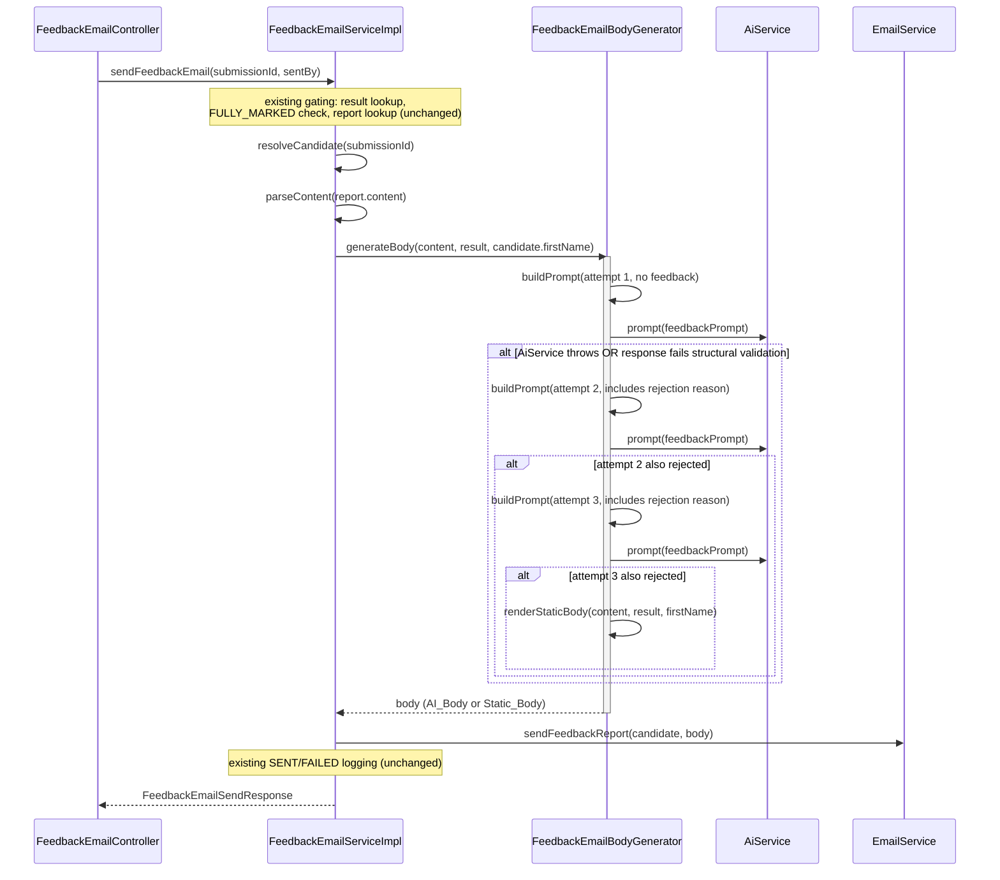

# Design Document

## Overview

`FeedbackEmailServiceImpl.sendFeedbackEmail` currently renders the candidate feedback email body
with a single deterministic method, `renderBody()`. This feature inserts an AI-generation attempt
*before* that rendering: the service builds a plain-text prompt from the candidate's first name,
assessment title, score, topic strengths/weaknesses, and next steps, sends it to the existing
`AiService.prompt(String)` abstraction, and structurally validates the response. A validated
response becomes the email body; an invalid response or an `AiService` exception is treated as a
rejection and triggers up to one retry (with the previous rejection reason folded into the retried
prompt). If all attempts are exhausted, the service falls back to the existing static rendering,
renamed `renderStaticBody()`, exactly as it behaves today.

All other `sendFeedbackEmail` behavior — 404/409 gating, subject line, `SENT`/`FAILED` send-log
persistence, the 502 path on `EmailService.sendFeedbackReport` failure — is unchanged. This is an
internal, additive change confined to `FeedbackEmailServiceImpl`; no new endpoints, no new
externally-observable API shape, and no schema changes.

This follows the same prompt → parse/validate → retry-once-with-feedback → give-up shape already
used by `QuestionGenerationServiceImpl` (`recruitment-be/src/main/java/com/psybergate/recruitment/ai/QuestionGenerationServiceImpl.java`),
adapted to a plain-text body instead of a JSON-parsed question draft, and to a max of 3 total
attempts (1 initial + up to 2 retries) instead of 2.

## Architecture



The generation/validation/retry/fallback logic is extracted into a new package-private
collaborator, `FeedbackEmailBodyGenerator`, rather than inlined into `FeedbackEmailServiceImpl`.
This mirrors the existing separation between `FeedbackEmailServiceImpl` (orchestration, gating,
logging) and `FeedbackEmailSendLogWriter` (a focused, independently-testable collaborator) already
present in this package, and keeps `FeedbackEmailServiceImpl` free of AI-specific control flow.

## Components and Interfaces

### `FeedbackEmailBodyGenerator` (new, package-private, `feedbackemail` package)

```java
@Component
@RequiredArgsConstructor
class FeedbackEmailBodyGenerator {

    String generateBody(FeedbackReportContent content, ResultSummaryResponse result, String candidateFirstName);
}
```

- Injected into `FeedbackEmailServiceImpl` via constructor (interface-free, like
  `FeedbackEmailSendLogWriter` — it has no other implementation and isn't consumed outside this
  package, so no separate interface is introduced).
- Depends on `AiService` (injected as the interface, per project convention).
- `generateBody` never throws for AI-related failures — any `AiService` exception is caught
  internally and treated as a rejection (Requirement 4.1). It performs up to 3 total
  `AiService.prompt(...)` calls (1 initial attempt + up to 2 retries) and always returns a
  non-null, non-blank body: either a validated AI_Body or the Static_Body.
- Owns three private steps, mirroring `QuestionGenerationServiceImpl`'s shape:
  - `buildPrompt(FeedbackReportContent, ResultSummaryResponse, String firstName, String previousRejectionReason)` —
    pure function, `previousRejectionReason` is `null` on the first attempt.
  - `validate(String aiBody, String candidateFirstName)` — returns the rejection reason as
    `Optional<String>` (empty = accepted), rather than throwing, since rejection is the expected/common
    control-flow path here (unlike `QuestionGenerationServiceImpl`, where a validation failure is
    caught as an exception). Using a return value instead of
    `AiGenerationValidationException` avoids exceptions-as-control-flow for an outcome that occurs
    on every AI hiccup, and keeps the retry loop a plain loop instead of nested try/catch.
  - `renderStaticBody(FeedbackReportContent, ResultSummaryResponse, String firstName)` — the
    existing `renderBody()` logic, renamed and moved onto this collaborator so all body-producing
    logic (AI and static) lives in one place. `FeedbackEmailServiceImpl` no longer renders bodies
    directly.

### `FeedbackEmailServiceImpl` (modified)

- Gains a new constructor dependency on `FeedbackEmailBodyGenerator`.
- `sendFeedbackEmail` replaces its current `String body = renderBody(content, result, candidate.getFirstName());`
  line with `String body = feedbackEmailBodyGenerator.generateBody(content, result, candidate.getFirstName());`.
- The private `renderBody` and `joinWithAnd` methods move to `FeedbackEmailBodyGenerator` (as
  `renderStaticBody` and `joinWithAnd` respectively). All other methods (`sendFeedbackEmail`,
  `parseContent`, `resolveCandidate`, `getSendHistory`) are unchanged.

### `AiService` (unchanged)

- Reused exactly as-is: `String prompt(String prompt)`. No new methods, no `promptForJson` usage
  (the output here is plain text, not JSON).

## Data Models

No new persisted entities, DTOs, or database schema changes. `FeedbackEmailBodyGenerator` operates
entirely on existing in-memory types:

- `FeedbackReportContent` (`overallSummary`, `topics: List<FeedbackTopicDto>`, `nextSteps: List<String>`) — existing.
- `FeedbackTopicDto` (`topic`, `strengths`, `weaknesses`) — existing.
- `ResultSummaryResponse` — existing; only `totalScore`/`maxScore` (for the percentage) are used, as today.
- `String candidateFirstName` — passed through from `Candidate.getFirstName()`, as today.

Internal, non-persisted helper state used only within `FeedbackEmailBodyGenerator`:

```java
private record GenerationAttempt(String body, String rejectionReason) {}
```

used to thread the previous attempt's rejection reason into the next `buildPrompt` call across the
retry loop. This is a local implementation detail, not a public/data-model type.

## Correctness Properties

*A property is a characteristic or behavior that should hold true across all valid executions of a
system — essentially, a formal statement about what the system should do. Properties serve as the
bridge between human-readable specifications and machine-verifiable correctness guarantees.*

`FeedbackEmailBodyGenerator`'s prompt-building, validation, and retry/fallback logic is pure,
input/output-driven business logic with a large input space (arbitrary candidate names, scores,
topic lists, next-steps lists, and arbitrary/adversarial AI response text) — a strong fit for
property-based testing. `AiService` itself is mocked in all property tests below; no real network
call is made, and no PBT is written against `AiService`/Groq's own behavior.

### Property 1: AI-first success path

*For any* valid `FeedbackReportContent`, `ResultSummaryResponse`, and candidate first name, and *for
any* AI_Body text that passes structural validation on the first attempt, `generateBody` SHALL
return exactly that AI_Body, SHALL call `AiService.prompt` exactly once, and SHALL NOT invoke
`renderStaticBody`.

**Validates: Requirements 1.1, 1.5**

### Property 2: Feedback_Prompt data completeness

*For any* valid `FeedbackReportContent`, `ResultSummaryResponse`, and candidate first name, the
built Feedback_Prompt SHALL contain the candidate's first name, the whole-number score percentage,
every topic name paired with a non-blank `strengths` value, every topic name paired with a
non-blank `weaknesses` value, and every entry of `nextSteps`.

**Validates: Requirements 1.2**

### Property 3: Feedback_Prompt instruction completeness

*For any* valid `FeedbackReportContent`, `ResultSummaryResponse`, and candidate first name, the
built Feedback_Prompt SHALL contain the fixed instructional text directing the AI to: open with a
personalized greeting, acknowledge effort/achievements, give 2 to 3 actionable recommendations,
close with encouragement and next steps, return plain text with no markdown, and sign off as "The
Psybergate Recruitment Team".

**Validates: Requirements 1.3, 1.4**

### Property 4: PII minimization in the prompt

*For any* candidate with a first name, last name, and email address, and *for any* submission ID
and candidate ID, the built Feedback_Prompt SHALL contain the first name and SHALL NOT contain the
last name, the email address, the submission ID, or the candidate ID.

**Validates: Requirements 2.1, 2.2**

### Property 5: Structural validation correctness

*For any* candidate first name and *for any* AI_Body text, `validate` SHALL reject the AI_Body if
and only if it is blank, OR does not contain the candidate's first name, OR does not contain "The
Psybergate Recruitment Team", OR contains any of `#`, `*`, `` ` ``, or `_`.

**Validates: Requirements 3.1**

### Property 6: Rejection triggers a corrective retry while attempts remain

*For any* sequence of rejected attempts (whether from structural validation failure or from an
`AiService` exception of any of the five listed types) where fewer than 3 total attempts have been
made, `generateBody` SHALL make exactly one additional `AiService.prompt` call, and the prompt for
that additional call SHALL contain the previous attempt's rejection reason.

**Validates: Requirements 3.2, 4.1**

### Property 7: Exhausted retries fall back to Static_Body with a still-successful result

*For any* sequence of exactly 3 rejected attempts (in any combination of structural-validation
rejections and `AiService` exceptions of the five listed types), `generateBody` SHALL return the
same value `renderStaticBody` would return for that input, SHALL make exactly 3 `AiService.prompt`
calls, and SHALL NOT throw.

**Validates: Requirements 3.3, 4.1, 4.2**

## Error Handling

- **`AiService` exceptions during generation** (`AiCommunicationException`, `AiTimeoutException`,
  `AiRateLimitException`, `AiAuthenticationException`, `AiResponseException`): caught inside
  `FeedbackEmailBodyGenerator.generateBody`'s retry loop and treated identically to a structural
  validation rejection — logged at `warn` (mirroring `QuestionGenerationServiceImpl`'s retry
  logging) with the exception's message used as the rejection reason fed into the next attempt's
  prompt. None of these exceptions ever propagate out of `generateBody`.
- **All 3 attempts rejected**: no exception is thrown; `generateBody` returns `renderStaticBody(...)`.
  `sendFeedbackEmail` proceeds exactly as it does today with that body — the caller of
  `sendFeedbackEmail` sees no AI-specific error, per Requirement 4.2.
- **Malformed stored feedback report content** (`parseContent` failing to deserialize
  `report.getContent()`): unchanged — still throws `AiResponseException`, which is unrelated to
  the new AI-generation path (this happens before `generateBody` is ever called) and continues to
  surface as today (a `@ResponseStatus`-annotated exception handled by `GlobalExceptionHandler`).
- **`EmailService.sendFeedbackReport` failure**: unchanged — still caught in
  `FeedbackEmailServiceImpl.sendFeedbackEmail`, still persists a `FAILED` row via
  `FeedbackEmailSendLogWriter.saveFailure` on `REQUIRES_NEW`, still rethrows as a 502. This path is
  identical whether the body that failed to send was AI-generated or the Static_Body.
- **`SENT` row persistence failure after a successful send**: unchanged — not caught by new code;
  existing behavior (treat `sendFeedbackEmail` as successful regardless) is preserved because
  nothing in this feature touches that code path.
- **Existing 404/409 gating** (missing submission, not `FULLY_MARKED`, missing report): unchanged,
  still evaluated before `generateBody` is ever invoked.

## Testing Strategy

**Dual approach**: property-based tests (jqwik, already a test-scope dependency in `pom.xml`) for
the seven universal properties above, plus example-based unit tests for concrete regression
scenarios and fault-injection edge cases that don't warrant a generator.

### Property-based tests

- New test class: `recruitment-be/src/test/java/com/psybergate/recruitment/feedbackemail/FeedbackEmailBodyGeneratorPropertyTest.java`.
- Library: **jqwik** (`net.jqwik:jqwik:1.9.3`, test scope — already present in `pom.xml`, same
  library used by `ScoreAnswerIgnoresAiSuggestionPropertyTest` and
  `FailedGenerationNeverBlocksManualMarkingPropertyTest`). No new PBT library is introduced.
- Each property is implemented as a single `@Property(tries = 100)` method (minimum 100 iterations,
  per project convention — the existing marking-package examples use `tries = 20`, but this design
  uses 100 as the floor for all new property tests here).
- `AiService` is mocked with Mockito in every property test; responses/exceptions per attempt are
  supplied via a `@ForAll`-generated sequence so a single property method can exercise "accepted on
  attempt 1", "accepted on attempt 2 after one rejection", "all 3 exhausted", and every exception
  type, across randomized `FeedbackReportContent`/`ResultSummaryResponse`/name/AI_Body inputs.
- Each test method is tagged with a comment referencing its design property, e.g.:
  ```java
  // Feature: ai-feedback-email-format, Property 5: Structural validation correctness
  @Property(tries = 100)
  void validationRejectsExactlyTheSpecifiedCases(...) { ... }
  ```
- Arbitraries needed: random candidate first/last names and emails (disjoint character sets to
  avoid accidental substring collisions), random `FeedbackReportContent` (0–5 topics with
  independently-nullable/blank `strengths`/`weaknesses`, 0–5 `nextSteps` strings), random whole-number
  score percentages via `totalScore`/`maxScore` pairs, random AI_Body strings including deliberately
  adversarial cases (blank, whitespace-only, missing first name, missing sign-off, containing each
  markdown marker in various positions, combinations thereof), and random selection among the 5
  `AiService` exception types.

### Unit tests (examples and edge cases)

Extend the existing `FeedbackEmailServiceImplTest` and add a new
`FeedbackEmailBodyGeneratorTest`:

- `FeedbackEmailServiceImplTest`: update the happy-path test to mock
  `FeedbackEmailBodyGenerator.generateBody(...)` returning a canned body (decoupling this test from
  AI-generation concerns, which move to the new test class); keep the existing 409/404/502 gating
  tests unchanged; add the fault-injection scenario from Requirement 5.4 (send succeeds, `SENT` row
  save throws, `sendFeedbackEmail` still returns success).
- `FeedbackEmailBodyGeneratorTest`: concrete examples for `renderStaticBody` (moved verbatim from
  the current `renderBody` tests — structured body, omitted strengths/weaknesses sentences) to
  cover Requirement 4.3's non-regression requirement, plus one example each for "AI succeeds on
  attempt 1", "AI succeeds on attempt 2 (retry includes rejection reason)", and "AI exhausted after
  3 attempts falls back to static body" as concrete, readable illustrations alongside the
  property tests.

All new/changed tests run under the existing `./mvnw test` command; no new test infrastructure,
TestContainers usage, or integration test is needed since `FeedbackEmailBodyGenerator` has no
database or HTTP dependency of its own beyond the mocked `AiService`.
