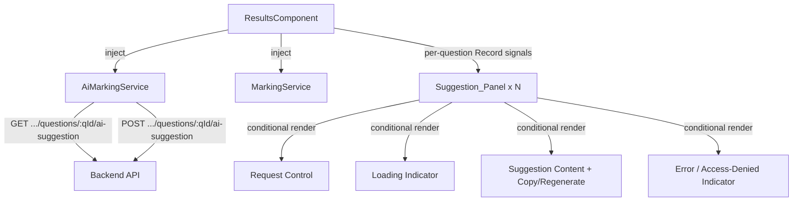

# Design Document: AI Marking Suggestions Frontend

## Overview

This design adds an AI-assisted marking suggestion UI to the existing Results & Evaluation page (`features/results/results.component.ts`), consuming the already-implemented backend endpoints `POST`/`GET /api/submissions/{submissionId}/questions/{questionId}/ai-suggestion`. Unlike the existing Feedback Report feature (which is a single per-submission state machine), this feature is **per-answer**: a submission can have many eligible questions open at once, each with its own independent request/loading/error/suggestion state. State is therefore modeled as `Record<questionId, T>` maps rather than single signals, with a per-question request-sequence guard (plus a per-submission "generation" counter) so that stale or out-of-order HTTP responses for one answer are silently discarded without disturbing any other answer or a since-abandoned submission view.

The feature introduces a new `AiMarkingService` under `core/ai-marking/`, model interfaces mirroring the backend DTO, an eligibility predicate shared by the visibility and dispatch logic, and a `Suggestion_Panel` template block added as a sibling — not a merge — of the existing `mark-row` block for both top-level questions and `GROUP` sub-questions.

The implementation follows existing project conventions: standalone injectable service with `inject()`, signals for reactive per-answer state, inline template/styles, and the same `Subscription`-based/`timeout()` patterns already used by `FeedbackService`/`ResultsComponent` — extended with a stale-response guard suited to concurrent, independently-keyed requests.

## Architecture



**Data Flow — Submission Selection (per-eligible-question, independent):**

```mermaid
sequenceDiagram
    participant RC as ResultsComponent
    participant AI as AiMarkingService
    participant API as Backend

    RC->>RC: selectSubmission() — bump aiGeneration, reset all AI Record signals
    RC->>RC: getResult() succeeds
    RC->>RC: compute eligibleQuestionIds() (TEXT/CODE_SUBMISSION, non-blank answer, incl. GROUP sub-qs)
    loop for each eligible questionId (independent, unordered)
        RC->>RC: aiLoading[qId] = true; capture generation + seq
        RC->>AI: getSuggestion(submissionId, qId)
        AI->>API: GET .../questions/{qId}/ai-suggestion
        alt stale (generation or seq changed before response)
            API-->>AI: response (any outcome)
            AI-->>RC: response
            RC->>RC: discard — no state mutated
        else 200 OK
            API-->>AI: AiMarkingSuggestionResponse
            AI-->>RC: suggestion
            RC->>RC: aiSuggestions[qId] = suggestion; aiLoading[qId] = false
        else 404
            API-->>AI: 404
            AI-->>RC: error(404)
            RC->>RC: aiLoading[qId] = false (no error shown — "request" control shown)
        else 401/403
            API-->>AI: error
            AI-->>RC: error
            RC->>RC: aiAccessDenied[qId] = true (sticky); aiLoading[qId] = false
        else other 4xx/5xx/network
            API-->>AI: error
            AI-->>RC: error
            RC->>RC: aiError[qId] = 'error'; aiLoading[qId] = false
        end
    end
```

**Data Flow — Generate / Regenerate (single dispatch path, race-guarded):**

```mermaid
sequenceDiagram
    participant RC as ResultsComponent
    participant AI as AiMarkingService
    participant API as Backend

    RC->>RC: requestAiSuggestion(qId) — activation (works whether first request or regenerate)
    RC->>RC: if aiLoading[qId] or aiAccessDenied[qId]: no-op
    RC->>RC: aiLoading[qId] = true; seq = ++aiRequestSeq[qId]; generation = aiGeneration
    RC->>AI: generateSuggestion(submissionId, qId)
    AI->>API: POST .../questions/{qId}/ai-suggestion
    alt response is stale (generation/seq mismatch on arrival)
        API-->>RC: (discarded)
    else 200 OK
        API-->>RC: new AiMarkingSuggestionResponse
        RC->>RC: aiSuggestions[qId] = new suggestion (replaces prior, if any); aiError[qId] = undefined
    else 400
        API-->>RC: error
        RC->>RC: aiError[qId] = 'ineligible'; aiSuggestions[qId] unchanged
    else 401/403
        API-->>RC: error
        RC->>RC: aiAccessDenied[qId] = true (sticky); aiSuggestions[qId] unchanged
    else other 4xx/5xx/network
        API-->>RC: error
        RC->>RC: aiError[qId] = 'error'; aiSuggestions[qId] unchanged
    end
    RC->>RC: aiLoading[qId] = false
```

## Components and Interfaces

### New Files

| File | Purpose |
|------|---------|
| `core/ai-marking/ai-marking.model.ts` | TypeScript interfaces for the API response and error-state union |
| `core/ai-marking/ai-marking.service.ts` | Injectable HTTP service for the two ai-suggestion endpoints |
| `core/ai-marking/ai-marking.service.spec.ts` | Vitest unit tests for the service |

### AiMarkingService Interface

```typescript
// core/ai-marking/ai-marking.service.ts
@Injectable({ providedIn: 'root' })
export class AiMarkingService {
  private readonly http = inject(HttpClient);

  getSuggestion(submissionId: string, questionId: string): Observable<AiMarkingSuggestionResponse> {
    return this.http.get<AiMarkingSuggestionResponse>(
      `/api/submissions/${submissionId}/questions/${questionId}/ai-suggestion`,
    );
  }

  generateSuggestion(submissionId: string, questionId: string): Observable<AiMarkingSuggestionResponse> {
    return this.http.post<AiMarkingSuggestionResponse>(
      `/api/submissions/${submissionId}/questions/${questionId}/ai-suggestion`,
      {},
    );
  }
}
```

Both methods take `submissionId`/`questionId` explicitly rather than a combined answer object — this mirrors the backend's path shape exactly and lets the component key all state off `questionId`, which is already the key used by the existing `editScores`/`editFeedback` maps.

### Why `questionId` as the state key (not `answerId`)

`ResultQuestion.answerId` can be `null` for a question the candidate has not answered, but eligibility already requires non-blank `candidateAnswer` content, so a `null` answerId never occurs for an eligible question in practice. Keying on `questionId` instead:
- Matches the existing `editScores`/`editFeedback` convention, keeping the template consistent.
- Avoids a `string | null` key type throughout the new Record signals.
- Is unique within one rendered submission's question list, including `GROUP` sub-questions, which is the only scope these maps need to cover (they are fully reset on every `selectSubmission()` call).

### Eligibility Predicate

```typescript
// shared by visibility checks and by which questionIds get an initial GET dispatched
function isAiEligibleQuestion(q: ResultQuestion): boolean {
  return (
    (q.questionType === 'TEXT' || q.questionType === 'CODE_SUBMISSION') &&
    hasAnswerContent(q.candidateAnswer)
  );
}

function hasAnswerContent(answer: string | null): boolean {
  return answer != null && answer.trim().length > 0;
}
```

Applied to top-level questions and, separately, to each entry of `q.subQuestions` when `q.questionType === 'GROUP'` — never to the `GROUP` question itself (its `questionType` is `'GROUP'`, which the type check already excludes).

```typescript
readonly eligibleQuestionIds = computed<string[]>(() => {
  const r = this.result();
  if (!r) return [];
  const ids: string[] = [];
  for (const q of r.questions) {
    if (q.questionType === 'GROUP') {
      for (const sub of q.subQuestions ?? []) {
        if (isAiEligibleQuestion(sub)) ids.push(sub.questionId);
      }
    } else if (isAiEligibleQuestion(q)) {
      ids.push(q.questionId);
    }
  }
  return ids;
});
```

### Signal State in ResultsComponent

```typescript
private readonly aiMarkingSvc = inject(AiMarkingService);

// Per-question AI suggestion state — Record keyed by questionId
readonly aiSuggestions = signal<Record<string, AiMarkingSuggestionResponse | undefined>>({});
readonly aiLoading = signal<Record<string, boolean>>({});
readonly aiError = signal<Record<string, AiSuggestionErrorKind | undefined>>({});
readonly aiAccessDenied = signal<Record<string, boolean>>({});

// Stale-response guarding — plain fields, not signals (internal bookkeeping only)
private aiGeneration = 0;
private aiRequestSeq: Record<string, number> = {};
```

`AiSuggestionErrorKind` is `'error' | 'ineligible'` — the sticky, permanent access-denied case is deliberately modeled as its own boolean map (`aiAccessDenied`) rather than a third value in `aiError`, because it has different lifecycle rules (Requirement 7.4: it must survive across further state transitions for that answer until the next `selectSubmission()`, whereas `aiError` is cleared at the start of every new attempt).

### State Reset on Submission Change

In `selectSubmission()`, append (alongside the existing feedback-state reset):

```typescript
this.aiGeneration++;
this.aiRequestSeq = {};
this.aiSuggestions.set({});
this.aiLoading.set({});
this.aiError.set({});
this.aiAccessDenied.set({});
```

Bumping `aiGeneration` invalidates every in-flight request from the previous submission — even one whose `questionId` happens to coincide with a question in the newly selected submission — before any per-question sequence check ever runs.

### Loading All Eligible Suggestions on Submission Select

After `getResult()` succeeds, independently issue one GET per eligible question:

```typescript
private loadAiSuggestions(submissionId: string): void {
  for (const questionId of this.eligibleQuestionIds()) {
    this.fetchAiSuggestion(submissionId, questionId);
  }
}

private fetchAiSuggestion(submissionId: string, questionId: string): void {
  const generation = this.aiGeneration;
  const seq = (this.aiRequestSeq[questionId] ?? 0) + 1;
  this.aiRequestSeq[questionId] = seq;
  this.aiLoading.update(s => ({ ...s, [questionId]: true }));

  this.aiMarkingSvc.getSuggestion(submissionId, questionId).subscribe({
    next: suggestion => {
      if (!this.isCurrentAiRequest(questionId, generation, seq)) return;
      this.aiSuggestions.update(s => ({ ...s, [questionId]: suggestion }));
      this.aiError.update(s => ({ ...s, [questionId]: undefined }));
      this.aiLoading.update(s => ({ ...s, [questionId]: false }));
    },
    error: (err: HttpErrorResponse) => {
      if (!this.isCurrentAiRequest(questionId, generation, seq)) return;
      this.applyAiErrorClassification(questionId, err, /* isGetFetch */ true);
      this.aiLoading.update(s => ({ ...s, [questionId]: false }));
    },
  });
}

private isCurrentAiRequest(questionId: string, generation: number, seq: number): boolean {
  return this.aiGeneration === generation && this.aiRequestSeq[questionId] === seq;
}
```

### Requesting / Regenerating a Suggestion

A single method handles both the first request and every subsequent regeneration — the backend endpoint and the frontend dispatch path are identical either way:

```typescript
requestAiSuggestion(submissionId: string, questionId: string): void {
  if (this.aiLoading()[questionId] || this.aiAccessDenied()[questionId]) return;

  const generation = this.aiGeneration;
  const seq = (this.aiRequestSeq[questionId] ?? 0) + 1;
  this.aiRequestSeq[questionId] = seq;
  this.aiLoading.update(s => ({ ...s, [questionId]: true }));
  this.aiError.update(s => ({ ...s, [questionId]: undefined }));

  this.aiMarkingSvc.generateSuggestion(submissionId, questionId).subscribe({
    next: suggestion => {
      if (!this.isCurrentAiRequest(questionId, generation, seq)) return;
      this.aiSuggestions.update(s => ({ ...s, [questionId]: suggestion }));
      this.aiError.update(s => ({ ...s, [questionId]: undefined }));
      this.aiLoading.update(s => ({ ...s, [questionId]: false }));
    },
    error: (err: HttpErrorResponse) => {
      if (!this.isCurrentAiRequest(questionId, generation, seq)) return;
      this.applyAiErrorClassification(questionId, err, /* isGetFetch */ false);
      this.aiLoading.update(s => ({ ...s, [questionId]: false }));
    },
  });
}

private applyAiErrorClassification(questionId: string, err: HttpErrorResponse, isGetFetch: boolean): void {
  if (err.status === 404 && isGetFetch) {
    // "No suggestion yet" — not an error state, request control is shown instead.
    return;
  }
  if (err.status === 401 || err.status === 403) {
    this.aiAccessDenied.update(s => ({ ...s, [questionId]: true }));
    return;
  }
  if (err.status === 400) {
    this.aiError.update(s => ({ ...s, [questionId]: 'ineligible' }));
    return;
  }
  this.aiError.update(s => ({ ...s, [questionId]: 'error' }));
}
```

`applyAiErrorClassification` is the single, total, mutually-exclusive mapping from an HTTP outcome (or its absence, for network errors/timeouts — `err.status === 0`, which falls through to the generic `'error'` branch) to one of the four named states: no-suggestion-yet, access-denied, ineligible, or generic error.

### Copying a Suggested Score into the Manual Mark Input

Pure client-side signal write — no HTTP call, reuses the existing `editScores` map so `saveScore()` needs no changes:

```typescript
copyAiScoreToMark(questionId: string): void {
  const suggestion = this.aiSuggestions()[questionId];
  if (!suggestion) return;
  this.editScores.update(s => ({ ...s, [questionId]: suggestion.score }));
}
```

Because this only fires on explicit button activation and writes through the same `editScores` map the manual input already binds to, it automatically satisfies "don't clear an edited value implicitly" — nothing else ever writes to `editScores` from AI suggestion state.

### Template Integration Point

The `Suggestion_Panel` is added as a **sibling** of the existing `mark-row` div — never inside it — for both the top-level question branch and the `GROUP` sub-question branch:

```html
@if (isAiEligibleQuestion(q)) {
  <section class="ai-suggestion-panel" [attr.aria-busy]="aiLoading()[q.questionId] ?? false">
    @if (aiAccessDenied()[q.questionId]) {
      <div class="ai-error ai-access-denied">Access denied — you do not have permission to request AI suggestions.</div>
    } @else if (aiLoading()[q.questionId]) {
      <div class="ai-loading"><span class="loading-dot"></span> Requesting AI suggestion…</div>
    } @else if (aiSuggestions()[q.questionId]) {
      <div class="ai-suggestion-header">
        <span class="ai-badge">AI Suggestion</span>
        <span class="ai-score">{{ aiSuggestions()[q.questionId]!.score }}/{{ aiSuggestions()[q.questionId]!.maxScore }}</span>
        <button class="save-btn secondary" (click)="copyAiScoreToMark(q.questionId)">Use this score</button>
        <button class="save-btn secondary" (click)="requestAiSuggestion(result()!.submissionId, q.questionId)">Regenerate</button>
      </div>
      <p class="ai-rationale">{{ aiSuggestions()[q.questionId]!.rationale }}</p>
      <div class="ai-meta">Generated: {{ formatDateTime(aiSuggestions()[q.questionId]!.generatedAt) }}</div>
    } @else {
      <div class="ai-request-row">
        <button class="save-btn secondary" (click)="requestAiSuggestion(result()!.submissionId, q.questionId)">Get AI Suggestion</button>
        @if (aiError()[q.questionId] === 'ineligible') {
          <span class="ai-error">Not eligible for AI-assisted marking.</span>
        } @else if (aiError()[q.questionId] === 'error') {
          <span class="ai-error">Could not get AI suggestion. Please try again.</span>
        }
      </div>
    }
  </section>
}
```

This block is placed immediately after each `mark-row` div — once for the top-level (non-`GROUP`) answer card, and once inside the `@for` over `q.subQuestions ?? []` for `GROUP` sub-answer cards — guarded by the same `isAiEligibleQuestion(...)` check used to build `eligibleQuestionIds`.

## Data Models

```typescript
// core/ai-marking/ai-marking.model.ts

export interface AiMarkingSuggestionResponse {
  answerId: string;
  score: number;
  maxScore: number;
  rationale: string;
  generatedAt: string;
}

export type AiSuggestionErrorKind = 'error' | 'ineligible';
```

`answerId` is retained on the response (matching the backend DTO) even though the frontend keys its state maps by `questionId` — it is available for future use (e.g. cross-checking against `ResultQuestion.answerId`) but not required by any current binding.

## Correctness Properties

*A property is a characteristic or behavior that should hold true across all valid executions of a system — essentially, a formal statement about what the system should do. Properties serve as the bridge between human-readable specifications and machine-verifiable correctness guarantees.*

### Property 1: Eligibility Predicate Correctness

*For any* question with any type (`MCQ`, `TEXT`, `CODE_SUBMISSION`, `GROUP`) and any candidate answer content (`null`, empty, whitespace-only, or non-blank text), `isAiEligibleQuestion(q)` SHALL return `true` if and only if the question's type is `TEXT` or `CODE_SUBMISSION` AND the answer content is non-null and contains at least one non-whitespace character. For any `GROUP` question, the `GROUP` question itself SHALL always be ineligible regardless of its sub-questions' eligibility, and `eligibleQuestionIds()` SHALL include exactly the ids of its sub-questions for which the same predicate holds.

**Validates: Requirements 1.3, 8.2, 8.3, 8.4**

### Property 2: Panel Visibility and Dispatch Follow Eligibility

*For any* `ResultSummary` with an arbitrary mix of eligible and ineligible questions (including `GROUP` questions with sub-questions), on submission selection: the Suggestion_Panel (request control, loading state, error state, or suggestion content) SHALL be rendered if and only if the question is a member of `eligibleQuestionIds()`, and exactly one GET request SHALL be dispatched to the ai-suggestion endpoint per eligible question id, with zero GET requests dispatched for any ineligible question.

**Validates: Requirements 1.1, 2.1, 2.3, 8.2, 8.3, 8.4**

### Property 3: Suggestion Content Completeness

*For any* `AiMarkingSuggestionResponse` stored in `aiSuggestions()` for a question, the rendered Suggestion_Panel content SHALL contain the suggestion's `score`, its `maxScore`, its `rationale`, and its `generatedAt` instant — none omitted.

**Validates: Requirements 2.2**

### Property 4: Activation Always Dispatches a Fresh Request

*For any* Candidate_Answer and any prior AI state for it (no suggestion, a displayed suggestion, or a prior error), activating the request control while no request is currently in flight and the answer is not access-denied SHALL cause `AiMarkingService.generateSuggestion` to be called exactly once for that answer's `(submissionId, questionId)` pair.

**Validates: Requirements 1.2, 1.4, 4.3**

### Property 5: In-Flight Requests Block Duplicate Dispatch

*For any* Candidate_Answer with `aiLoading()[questionId] === true`, any number of additional activations of the request control for that answer SHALL result in zero additional calls to `AiMarkingService.generateSuggestion` until the in-progress request resolves.

**Validates: Requirements 1.5, 3.3, 6.4**

### Property 6: Per-Answer State Isolation

*For any* two distinct question ids `a` and `b` within the same submission, any state transition triggered for `a` (loading start/end, suggestion received, any error, access-denied) SHALL leave `aiSuggestions()[b]`, `aiLoading()[b]`, `aiError()[b]`, and `aiAccessDenied()[b]` unchanged.

**Validates: Requirements 1.7, 2.5, 3.1**

### Property 7: Loading Indicator Lifecycle

*For any* Candidate_Answer and any sequence of generate/regenerate/fetch requests issued for it, `aiLoading()[questionId]` SHALL be `true` for the entire duration between a non-stale request being issued and its response (success or failure) being applied, and SHALL be `false` immediately after that response is applied, regardless of whether the request succeeded or failed.

**Validates: Requirements 3.1, 3.4**

### Property 8: Stale Response Discarding

*For any* Candidate_Answer for which two or more generate/regenerate/fetch requests are issued in sequence (whether due to rapid regeneration or a submission-change bumping `aiGeneration`), only the response belonging to the most-recently-issued non-superseded request SHALL be applied to `aiSuggestions`, `aiLoading`, `aiError`, or `aiAccessDenied` for that question id; every earlier-issued request's response, if it arrives after being superseded, SHALL be discarded and SHALL NOT mutate any signal.

**Validates: Requirements 1.6, 6.5**

### Property 9: Failed Requests Never Mutate the Stored Suggestion

*For any* Candidate_Answer that has a previously stored `aiSuggestions()[questionId]` value, a subsequent failed generate/regenerate/fetch request for that same question id (any failure classification) SHALL leave `aiSuggestions()[questionId]` exactly equal to its value before the failed request, while `aiError()[questionId]` or `aiAccessDenied()[questionId]` may change.

**Validates: Requirements 4.1**

### Property 10: AI State Transitions Never Affect Manual Marking Inputs

*For any* Candidate_Answer and any AI suggestion state transition (loading start, success, or any failure classification) for that question id or any other question id, the values of `editScores()` and `editFeedback()` for every question id SHALL remain unchanged, except for the single write performed by `copyAiScoreToMark` in Property 12.

**Validates: Requirements 3.2, 4.2**

### Property 11: HTTP Outcome Classification Is Total and Mutually Exclusive

*For any* HTTP response or absence of response (network error, timeout, or any status code) resulting from a generate or fetch request, `applyAiErrorClassification` SHALL map it to exactly one of four mutually exclusive outcomes: no-suggestion-yet (404 on a fetch, request control shown without error), access-denied (401 or 403), ineligible (400), or generic error (any other 4xx/5xx status, or no response at all) — and never to more than one, and never to none.

**Validates: Requirements 4.4, 4.5, 4.6, 7.2, 7.3, 8.1**

### Property 12: Access-Denied Is Sticky Per Answer

*For any* Candidate_Answer for which `aiAccessDenied()[questionId]` has been set to `true` by a 401/403 response, that value SHALL remain `true` across any number of subsequent state transitions for that same question id (including successful or failed requests for other answers in the same submission), and the request control for that question id SHALL remain disabled, until `selectSubmission()` is next called (which resets all AI state via the `aiGeneration` bump).

**Validates: Requirements 7.4**

### Property 13: Copy Control Visibility Depends Only on Suggestion Presence

*For any* Candidate_Answer, the "Use this score" copy control SHALL be visible in the Suggestion_Panel if and only if `aiSuggestions()[questionId]` is defined, independent of whether `aiLoading()[questionId]` is simultaneously `true` (i.e. a regeneration in progress does not hide the previously displayed suggestion or its copy control until the regeneration resolves).

**Validates: Requirements 5.1**

### Property 14: Copy Activation Writes Exactly the Suggested Score, Persistently, With No HTTP Call

*For any* Candidate_Answer with a displayed `AiMarkingSuggestionResponse` and any prior value of `editScores()[questionId]` (unset, manually entered, or previously copied), activating `copyAiScoreToMark(questionId)` SHALL set `editScores()[questionId]` to exactly the suggestion's `score`, SHALL issue zero calls to any `MarkingService` scoring method, and that written value SHALL remain unchanged by any subsequent AI suggestion state transition (new suggestion arriving, loading, or error) until either a manual edit to that same input or another explicit copy activation occurs.

**Validates: Requirements 5.2, 5.3, 5.4, 5.5**

### Property 15: Successful Generate/Regenerate Fully Replaces the Prior Suggestion

*For any* Candidate_Answer and any prior suggestion state (none, or a previously displayed `AiMarkingSuggestionResponse`), a successful generate/regenerate response SHALL become the sole value of `aiSuggestions()[questionId]`, exactly equal to the new response, with no template binding or component method able to read the prior value afterward, and at no point SHALL more than one suggestion be simultaneously stored for that question id.

**Validates: Requirements 6.1, 6.2, 6.3**

## Error Handling

| Scenario | Behaviour |
|----------|-----------|
| `getSuggestion()` → 404 | Treated as "no suggestion yet" — request control shown, no error indication |
| `getSuggestion()` → non-404 4xx/5xx | `aiError[qId] = 'error'`; request control shown alongside a generic error message |
| `getSuggestion()` → 401/403 | `aiAccessDenied[qId] = true` (sticky); access-denied indication shown; request control disabled |
| `generateSuggestion()` → 400 | `aiError[qId] = 'ineligible'`; message explains the question/answer is not eligible; no suggestion content shown |
| `generateSuggestion()` → 401/403 | Same sticky access-denied handling as above |
| `generateSuggestion()` → other 4xx/5xx | `aiError[qId] = 'error'`; prior suggestion (if any) retained unchanged |
| Network error / no response (status 0, timeout) | Same as generic error — `aiError[qId] = 'error'` |
| Submission changed mid-request | `aiGeneration` bump invalidates all in-flight requests from the previous submission; their responses are discarded on arrival |
| Regenerate activated while a request is already in flight for that answer | No-op — `requestAiSuggestion` returns immediately without dispatching |
| Regenerate activated after `aiAccessDenied[qId] === true` | No-op — control remains disabled until next `selectSubmission()` |
| One answer's request fails | Every other answer's independent request/state is completely unaffected (Property 6) |

**Error message content:** All user-facing error strings are static, plain-language messages (e.g. "Could not get AI suggestion. Please try again.", "Not eligible for AI-assisted marking.", "Access denied — you do not have permission to request AI suggestions.") and never surface raw HTTP status codes or backend error bodies.

**Retry flow:** Clicking the request control again after a non-sticky error (`'error'` or `'ineligible'`) clears that error and dispatches a fresh `generateSuggestion` call (Property 4). There is no separate "Retry" button — the same request control serves both the first request and any retry.

## Testing Strategy

### Unit Tests (Vitest)

- **AiMarkingService** — verify HTTP method (GET/POST), URL construction from `submissionId`/`questionId`, and empty POST body.
- **Eligibility predicate (`isAiEligibleQuestion`, `eligibleQuestionIds`)** — concrete examples for each `QuestionType`, `null`/empty/whitespace answers, and a `GROUP` question with a mix of eligible/ineligible sub-questions.
- **Template structure** — assert the `.ai-suggestion-panel` element is a sibling of `.mark-row` (not nested inside it) for both a top-level question and a `GROUP` sub-question, using `TestBed` + `DebugElement` queries (Requirement 2.4 — DOM structure is fixed regardless of input, not meaningfully varied by randomization, so covered by example-based assertions rather than PBT).
- **Route/access restriction** — the existing route guard and auth interceptor are unchanged by this feature (Requirement 7.1); no new test is required beyond the existing guard/interceptor test suite.

### Property-Based Tests (fast-check + Vitest)

- Library: `fast-check` (already used elsewhere in this codebase's frontend for PBT).
- Minimum 100 iterations per property test: `fc.assert(fc.property(...), { numRuns: 100 })`.
- Each test is tagged with a comment referencing its design property, e.g.
  `// Feature: ai-marking-suggestions-frontend, Property 8: stale response discarding`.
- Implement each correctness property above with a single property-based test.

| Property | Generator Strategy |
|----------|--------------------|
| 1: Eligibility predicate | `fc.record({ questionType: fc.constantFrom('MCQ','TEXT','CODE_SUBMISSION','GROUP'), candidateAnswer: fc.oneof(fc.constant(null), fc.constant(''), fc.stringOf(fc.constantFrom(' ','\t','\n')), fc.string({minLength:1})) })`, plus a nested generator for `GROUP` questions with an array of sub-question records |
| 2: Visibility/dispatch | `fc.array(fc.record({ questionType, candidateAnswer, subQuestions }))` building a full `ResultSummary.questions` array with a mock `HttpTestingController` counting dispatched requests |
| 3: Content completeness | `fc.record({ answerId: fc.uuid(), score: fc.integer(), maxScore: fc.integer({min:1}), rationale: fc.string(), generatedAt: fc.date().map(d => d.toISOString()) })` |
| 4: Activation dispatches | `fc.constantFrom('none','suggested','errored')` prior-state, verifying exactly one POST per activation |
| 5: In-flight blocks duplicates | `fc.integer({min: 1, max: 10})` activation attempts while loading, asserting call count stays at the initial 1 |
| 6: Per-answer isolation | `fc.tuple(fc.uuid(), fc.uuid())` filtered to distinct ids, with random state transitions applied to one and asserted absent from the other |
| 7: Loading lifecycle | `fc.boolean()` success/failure outcome combined with random delay ordering |
| 8: Stale response discarding | `fc.array(fc.record({ delayMs: fc.integer({min:0,max:1000}), outcome: fc.constantFrom('success','error') }), {minLength:2})` — later-issued, earlier-resolving requests must still win over earlier-issued, later-resolving ones |
| 9: No mutation on failure | `fc.record(AiMarkingSuggestionResponse generator)` as prior state + random failure classification |
| 10: No cross-write to manual inputs | Random `editScores`/`editFeedback` snapshots + random AI transitions, asserting deep-equality before/after except via explicit copy |
| 11: HTTP classification totality | `fc.oneof(fc.constant(undefined status /* network error */), fc.integer({min:400,max:599}))` combined with `fc.boolean()` for fetch-vs-generate, asserting the mapping is total and single-valued |
| 12: Sticky access-denied | `fc.array(fc.constantFrom('success','error','ineligible'), {minLength:0,maxLength:5})` subsequent transitions applied after an initial 401/403, asserting `aiAccessDenied` never flips back |
| 13: Copy visibility | `fc.boolean()` for `aiLoading` combined with `fc.option(AiMarkingSuggestionResponse generator)` for suggestion presence |
| 14: Copy write semantics | `fc.oneof(fc.constant(undefined), fc.integer())` prior `editScores` value + suggested score, asserting overwrite, zero HTTP calls, and persistence through a follow-up random AI transition |
| 15: Full replacement | Two successive `AiMarkingSuggestionResponse` generator instances, asserting the second fully replaces the first with no reachable path to the first afterward |

### Integration Tests

- Full submission-select → per-question GET fan-out flow with `provideHttpClientTesting()` and `HttpTestingController`, asserting one GET per eligible question and zero for ineligible ones.
- Regenerate flow: POST → 200 replaces displayed suggestion; POST → 400/401/403/5xx each produce the correct, distinct panel state.
- Submission-switch mid-flight: select submission A, let a GET start, switch to submission B before it resolves, flush A's response, assert it never appears in B's view.
- Copy-then-save: activate copy control, then `saveScore()`, asserting the submitted `ScoreAnswerRequest.score` equals the suggested score.

### Styling Approach

AI suggestion panel styles are added inline in `ResultsComponent`'s `styles` array, following the same CSS-variable-based theming already used for the feedback section:

```css
.ai-suggestion-panel {
  margin: 8px 0 0;
  padding: 10px 12px;
  background: var(--bg-elevated);
  border: 1px solid var(--border);
  border-radius: var(--radius-sm);
}

.ai-suggestion-header {
  display: flex; align-items: center; gap: 8px; flex-wrap: wrap;
}

.ai-badge {
  font-size: 10.5px; padding: 2px 8px; border-radius: 999px;
  background: var(--accent-subtle); color: var(--accent);
  font-weight: 600;
}

.ai-score { font-size: 13px; font-weight: 600; color: var(--text-1); }

.ai-rationale { font-size: 12.5px; color: var(--text-2); line-height: 1.5; margin: 8px 0 0; }

.ai-meta { font-size: 11px; color: var(--text-3); margin-top: 6px; }

.ai-loading {
  display: flex; align-items: center; gap: 8px;
  font-size: 12.5px; color: var(--text-2);
}

.ai-error {
  font-size: 12px; color: var(--danger);
}

.ai-access-denied {
  font-size: 12px; color: var(--danger); font-weight: 500;
}

.ai-request-row {
  display: flex; align-items: center; gap: 10px; flex-wrap: wrap;
}
```
