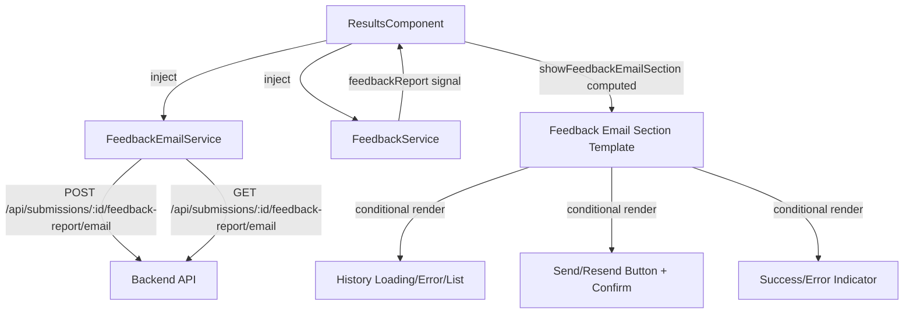
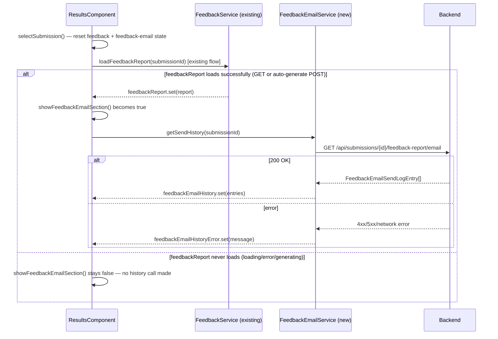
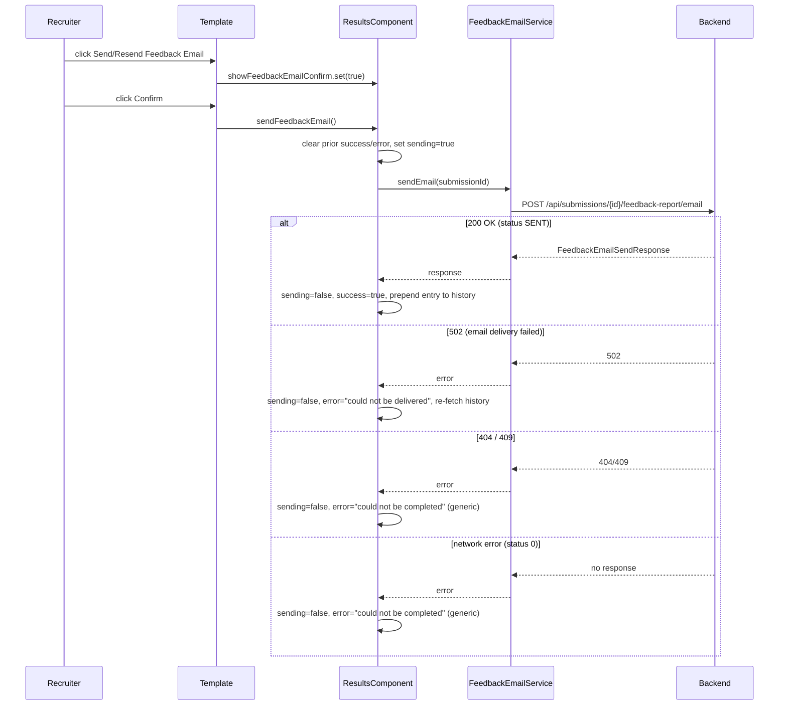

# Design Document: Candidate Feedback Email Frontend

## Overview

This design adds a feedback-email send/resend UI to the existing Results & Evaluation page, alongside the already-implemented Feedback Report Section (from `submission-feedback-report-frontend`). It introduces a `FeedbackEmailService` under `core/feedback-email/`, model interfaces mirroring the backend's `FeedbackEmailSendResponse`/`FeedbackEmailSendLogEntry` contract, and a signal-based state machine within `ResultsComponent` that manages send-history loading, a confirm→send→result flow, and error classification.

The implementation deliberately mirrors two existing patterns rather than inventing new ones:
- **Structurally**, `FeedbackEmailService` mirrors `FeedbackService` (`core/feedback/`) — a minimal `providedIn: 'root'` service with synchronous empty-ID validation before any HTTP call.
- **Interaction-wise**, the Feedback_Email_Section mirrors the Reminder section already in `ResultsComponent` — a button that reveals a Confirm/Cancel prompt, a `sending` boolean that gates the button label/disabled state, and a signal-held history array rendered in an `.audit-section`.

The section is visually and logically anchored to the existing Feedback Report Section: it only appears once a feedback report has actually loaded for the selected submission, since emailing a report that doesn't exist yet makes no sense. This means its visibility depends on the sibling feature's `feedbackReport` signal, not just `markingStatus` alone.

## Architecture



**Visibility and history-load sequence** — the Feedback_Email_Section piggybacks on the Feedback Report Section's success signal rather than firing independently off `markingStatus`:



**Send/resend sequence:**



## Components and Interfaces

### New Files

| File | Purpose |
|------|---------|
| `core/feedback-email/feedback-email.model.ts` | TypeScript interfaces for the API contract |
| `core/feedback-email/feedback-email.service.ts` | Injectable HTTP service for feedback-email endpoints |
| `core/feedback-email/feedback-email.service.spec.ts` | Vitest unit + property tests for the service |

### FeedbackEmailService

Mirrors `FeedbackService`'s shape exactly — `inject()`-based `HttpClient`, synchronous empty-ID guard before any request is issued (Requirement 1.5), matching the stricter precedent set by `FeedbackService.getReport`/`generateReport` rather than `ReminderService` (which has no such guard).

```typescript
// core/feedback-email/feedback-email.service.ts
@Injectable({ providedIn: 'root' })
export class FeedbackEmailService {
  private readonly http = inject(HttpClient);

  sendEmail(submissionId: string): Observable<FeedbackEmailSendResponse> {
    if (!submissionId) throw new Error('submissionId must not be empty');
    return this.http.post<FeedbackEmailSendResponse>(
      `/api/submissions/${submissionId}/feedback-report/email`,
      {},
    );
  }

  getSendHistory(submissionId: string): Observable<FeedbackEmailSendLogEntry[]> {
    if (!submissionId) throw new Error('submissionId must not be empty');
    return this.http.get<FeedbackEmailSendLogEntry[]>(
      `/api/submissions/${submissionId}/feedback-report/email`,
    );
  }
}
```

### Signal State in ResultsComponent

New fields added alongside the existing `feedback*` fields:

```typescript
private readonly feedbackEmailSvc = inject(FeedbackEmailService);

// Feedback-email history state
readonly feedbackEmailHistory = signal<FeedbackEmailSendLogEntry[]>([]);
readonly feedbackEmailHistoryLoading = signal(false);
readonly feedbackEmailHistoryError = signal<string | null>(null);

// Feedback-email send-action state
readonly showFeedbackEmailConfirm = signal(false);
readonly feedbackEmailSending = signal(false);
readonly feedbackEmailSuccess = signal(false);
readonly feedbackEmailError = signal<string | null>(null);

private feedbackEmailSub?: Subscription;
```

### Visibility (Requirement 3)

A `computed()` that gates the section on both `markingStatus` and the sibling feature's `feedbackReport` signal — visibility is the conjunction, not `markingStatus` alone:

```typescript
readonly showFeedbackEmailSection = computed(() =>
  this.result()?.markingStatus === 'FULLY_MARKED' && this.feedbackReport() !== null
);
```

Because `feedbackReport()` is `null` while loading, while generating, and after any error (it's only ever set on a successful GET or POST — see the sibling design's `loadFeedbackReport`), this single computed correctly implements all three sub-cases of Requirement 3 (3.1 visible, 3.2 hidden on `PENDING_REVIEW`, 3.3 hidden while not-yet-loaded) with no extra state.

### State Reset on Submission Change (Requirement 3.4)

Appended to the existing reset block in `selectSubmission()`, alongside the sibling feature's `feedbackSub?.unsubscribe()`:

```typescript
this.feedbackEmailSub?.unsubscribe();
this.feedbackEmailHistory.set([]);
this.feedbackEmailHistoryLoading.set(false);
this.feedbackEmailHistoryError.set(null);
this.showFeedbackEmailConfirm.set(false);
this.feedbackEmailSending.set(false);
this.feedbackEmailSuccess.set(false);
this.feedbackEmailError.set(null);
```

### Triggering the History Load (Requirement 4.1)

Because visibility depends on `feedbackReport()` becoming non-null, the history load is triggered from the exact two places inside the existing (sibling-feature) `loadFeedbackReport()` where `feedbackReport.set(report)` succeeds — the GET-succeeds branch and the auto-generate-POST-succeeds branch — rather than from a separate effect:

```typescript
// Inside the sibling's loadFeedbackReport(), GET-success branch:
next: report => {
  this.feedbackReport.set(report);
  this.feedbackLoading.set(null);
  this.loadFeedbackEmailHistory(submissionId); // NEW
},

// Inside the nested generate-success branch:
next: report => {
  if (this.selectedSummary()?.submissionId === submissionId) {
    this.feedbackReport.set(report);
    this.loadFeedbackEmailHistory(submissionId); // NEW
  }
  this.feedbackLoading.set(null);
},
```

### Loading Send History (Requirements 4.2–4.7)

```typescript
private loadFeedbackEmailHistory(submissionId: string): void {
  this.feedbackEmailHistoryLoading.set(true);
  this.feedbackEmailHistoryError.set(null);

  this.feedbackEmailSub = this.feedbackEmailSvc.getSendHistory(submissionId).subscribe({
    next: history => {
      // Guard: discard if the user has since switched submissions (Req 4.7)
      if (this.selectedSummary()?.submissionId === submissionId) {
        this.feedbackEmailHistory.set(history);
        this.feedbackEmailHistoryLoading.set(false);
      }
    },
    error: () => {
      if (this.selectedSummary()?.submissionId === submissionId) {
        this.feedbackEmailHistoryError.set('Could not load send history. Please try again.');
        this.feedbackEmailHistoryLoading.set(false);
      }
    },
  });
}

retryFeedbackEmailHistory(): void {
  const submissionId = this.selectedSummary()?.submissionId;
  if (!submissionId) return;
  this.loadFeedbackEmailHistory(submissionId);
}
```

Stale-response handling (Requirement 4.7) is doubly guarded, exactly like the sibling's `feedbackSub`: `selectSubmission()` unsubscribes `feedbackEmailSub` immediately on every submission change, **and** the `next`/`error` callbacks re-check `selectedSummary()?.submissionId === submissionId` before touching state — so even a response that arrives in the gap between unsubscribe-call and actual teardown is discarded.

History entries are rendered directly in array order (`@for (entry of feedbackEmailHistory(); ...)`), with no client-side sort — satisfying Requirement 4.4's "without re-sorting" constraint by construction.

### Send / Resend Button Label

```typescript
readonly feedbackEmailButtonLabel = computed(() =>
  this.feedbackEmailHistory().length === 0 ? 'Send Feedback Email' : 'Resend Feedback Email'
);
```

The template overrides this with `"Sending…"` whenever `feedbackEmailSending()` is true, regardless of history length (Requirement 6.6):

```html
{{ feedbackEmailSending() ? 'Sending…' : feedbackEmailButtonLabel() }}
```

### Sending the Email (Requirements 6.3–6.6, 7.1–7.6)

```typescript
sendFeedbackEmail(): void {
  const submissionId = this.selectedSummary()?.submissionId;
  if (!submissionId) return;

  // Req 7.6: clear prior success/error before the new request begins
  this.feedbackEmailSuccess.set(false);
  this.feedbackEmailError.set(null);
  this.feedbackEmailSending.set(true);

  this.feedbackEmailSvc.sendEmail(submissionId).subscribe({
    next: response => {
      this.feedbackEmailSending.set(false);
      this.showFeedbackEmailConfirm.set(false);
      this.feedbackEmailSuccess.set(true);
      // Req 7.1: optimistic update — prepend without a re-fetch/reload.
      // sentBy is unknown from this response shape; omitted (null) here is
      // self-correcting on the next natural history refresh (re-selecting
      // the submission), and satisfies Req 5.4's "omit if null" rule.
      this.feedbackEmailHistory.update(h => [
        { sentAt: response.sentAt, status: response.status, sentBy: null, failureReason: null },
        ...h,
      ]);
      setTimeout(() => this.feedbackEmailSuccess.set(false), 3000);
    },
    error: (err: HttpErrorResponse) => {
      this.feedbackEmailSending.set(false);
      const { message, refetch } = this.classifySendError(err);
      this.feedbackEmailError.set(message);
      if (refetch) {
        this.loadFeedbackEmailHistory(submissionId);
      }
    },
  });
}

/**
 * Pure classification function (Requirements 7.2–7.4, 8.1): maps any send
 * failure to a sanitized, non-technical message and a refetch flag. Only a
 * 502 (email genuinely attempted and failed server-side, recorded as a
 * FAILED log row) warrants re-fetching history to surface that new row —
 * 404/409 and network errors never reached a log-write, so there is nothing
 * new to fetch.
 */
private classifySendError(err: HttpErrorResponse): { message: string; refetch: boolean } {
  if (err.status === 502) {
    return { message: 'The feedback email could not be delivered to the candidate.', refetch: true };
  }
  return { message: 'The feedback email could not be sent. Please try again.', refetch: false };
}
```

`showFeedbackEmailConfirm`/Cancel wiring in the template follows the reminder section's exact shape — clicking Cancel simply sets `showFeedbackEmailConfirm` back to `false` without ever touching `feedbackEmailSvc` (Requirement 6.4), and Confirm calls `sendFeedbackEmail()` (Requirement 6.5). Requirement 7.5 (button always re-enables with default label after any outcome) holds structurally because every code path in the `next`/`error` callbacks above sets `feedbackEmailSending.set(false)`.

### Dismissing a Send Error (Requirement 8.3)

```html
<button class="dismiss-btn" (click)="feedbackEmailError.set(null)">✕</button>
```

Clearing only `feedbackEmailError` leaves `feedbackEmailHistory` untouched by construction — no code path connects the two signals.

### Template Integration Point

Inserted as a sibling block immediately after the existing Feedback Report Section (`<section class="feedback-section">`), still before the answers-title — since the email action is a natural extension of "there is now a report to email":

```html
<!-- (existing) Feedback Report Section -->
@if (result()!.markingStatus === 'FULLY_MARKED') {
  <section class="feedback-section" ...> ... </section>
}

<!-- NEW: Feedback Email Section -->
@if (showFeedbackEmailSection()) {
  <div class="feedback-email-section">
    <div class="feedback-email-controls">
      @if (!showFeedbackEmailConfirm()) {
        <button class="btn-reminder" (click)="showFeedbackEmailConfirm.set(true)" [disabled]="feedbackEmailSending()">
          ✉ {{ feedbackEmailSending() ? 'Sending…' : feedbackEmailButtonLabel() }}
        </button>
      } @else {
        <div class="reminder-confirm">
          <span class="reminder-confirm-text">Send the feedback report email to this candidate?</span>
          <button class="save-btn" (click)="sendFeedbackEmail()" [disabled]="feedbackEmailSending()">
            {{ feedbackEmailSending() ? 'Sending…' : 'Confirm' }}
          </button>
          <button class="save-btn secondary" (click)="showFeedbackEmailConfirm.set(false)" [disabled]="feedbackEmailSending()">Cancel</button>
        </div>
      }
      @if (feedbackEmailSuccess()) {
        <span class="reminder-toast">✓ Feedback email sent</span>
      }
      @if (feedbackEmailError()) {
        <div class="feedback-inline-error">
          {{ feedbackEmailError() }}
          <button class="dismiss-btn" (click)="feedbackEmailError.set(null)">✕</button>
        </div>
      }
    </div>

    <div class="audit-section">
      <div class="audit-title">Feedback Email History</div>
      @if (feedbackEmailHistoryLoading()) {
        <div class="feedback-loading"><span class="loading-dot"></span> Loading send history…</div>
      } @else if (feedbackEmailHistoryError()) {
        <div class="feedback-error">
          <span>{{ feedbackEmailHistoryError() }}</span>
          <button class="save-btn" (click)="retryFeedbackEmailHistory()">Retry</button>
        </div>
      } @else if (feedbackEmailHistory().length === 0) {
        <div class="audit-empty">No feedback emails sent yet</div>
      } @else {
        @for (entry of feedbackEmailHistory(); track $index) {
          <div class="audit-entry">
            <span class="audit-action">
              <span class="marking-badge" [class.badge-done]="entry.status === 'SENT'" [class.badge-pending]="entry.status === 'FAILED'">
                {{ entry.status === 'SENT' ? '✓ Sent' : '✕ Failed' }}
              </span>
              @if (entry.sentBy) {
                <span>by {{ entry.sentBy }}</span>
              }
            </span>
            <span class="audit-meta">{{ formatDateTime(entry.sentAt) }}</span>
          </div>
          @if (entry.status === 'FAILED' && entry.failureReason) {
            <div class="feedback-email-failure-reason">{{ entry.failureReason }}</div>
          }
        }
      }
    </div>
  </div>
}

<!-- (existing) Per-question answers -->
<div class="answers-title">...</div>
```

Entries have no stable unique ID in the API contract (unlike `ReminderSendLogDto.id`), so `track $index` is used — acceptable since the list is replaced wholesale on every fetch/optimistic-update rather than mutated in place.

## Data Models

```typescript
// core/feedback-email/feedback-email.model.ts

export interface FeedbackEmailSendResponse {
  submissionId: string;
  status: 'SENT' | 'FAILED';
  sentAt: string;
}

export interface FeedbackEmailSendLogEntry {
  sentAt: string;
  status: 'SENT' | 'FAILED';
  sentBy: string | null;
  failureReason: string | null;
}
```

These match the backend's `FeedbackEmailSendResponse`/`FeedbackEmailSendLogDto` DTOs field-for-field (per the `candidate-feedback-email` backend design), with `Instant`/`UUID` fields represented as `string` — consistent with how `ReminderSendLogDto` and `FeedbackReportResponse` already represent backend `Instant`/`UUID` values on the frontend.

## Correctness Properties

*A property is a characteristic or behavior that should hold true across all valid executions of a system — essentially, a formal statement about what the system should do. Properties serve as the bridge between human-readable specifications and machine-verifiable correctness guarantees.*

The prework above classified the large majority of testable acceptance criteria as PROPERTY-suitable — this feature is almost entirely pure state-transition logic, URL construction, and rendering derived from signal state, which is ideal for PBT. A handful of criteria (6.3, 6.4, 6.5, 8.2) are concrete, deterministic interaction sequences better served by example-based tests. Structural/type-only criteria (1.1, 1.4, 2.1–2.3) and the one-time tooling check (2.4) are not testable as properties. The reflection step consolidated 27 initially-classified criteria into 19 non-redundant properties, several of which merge an acceptance criterion with its explicit negative/complementary counterpart into a single "if and only if" statement.

### Property 1: Service URL and Verb Construction

*For any* non-empty `submissionId` string (including strings with special characters, unicode, and path-sensitive characters), `sendEmail(submissionId)` SHALL issue a POST with an empty body to exactly `/api/submissions/${submissionId}/feedback-report/email`, and `getSendHistory(submissionId)` SHALL issue a GET to that same URL.

**Validates: Requirements 1.2, 1.3**

### Property 2: Empty SubmissionId Validation

*For any* empty string, calling `sendEmail('')` or `getSendHistory('')` SHALL throw a synchronous error without issuing any HTTP request. *For any* non-empty string, neither method SHALL throw synchronously.

**Validates: Requirements 1.5**

### Property 3: Feedback Email Section Visibility Matches Report Availability

*For any* combination of `markingStatus` (`'FULLY_MARKED'` | `'PENDING_REVIEW'`) and feedback-report load state (`feedbackReport()` is a loaded report, or is `null` because it is loading/generating/errored), the Feedback_Email_Section SHALL be rendered if and only if `markingStatus === 'FULLY_MARKED'` AND `feedbackReport() !== null`.

**Validates: Requirements 3.1, 3.2, 3.3**

### Property 4: State Reset on Submission Change

*For any* prior feedback-email state (arbitrary non-empty history list, arbitrary error/success/loading flag values, confirm-prompt visibility, and sending state), calling `selectSubmission()` with a different submission SHALL reset `feedbackEmailHistory` to `[]`, and all of `feedbackEmailHistoryLoading`, `feedbackEmailHistoryError`, `showFeedbackEmailConfirm`, `feedbackEmailSending`, `feedbackEmailSuccess`, `feedbackEmailError` to their initial falsy/null values, before any new load begins.

**Validates: Requirements 3.4**

### Property 5: History Loading State Reflects Fetch Outcome Exactly

*For any* sequence of a `getSendHistory()` call in flight followed by either a successful response (any list, including empty) or a failure (any `HttpErrorResponse` or network error), at every point in time: the loading indicator is shown if and only if the call is in flight; the error message and retry control are shown if and only if the most recent completed call failed; and neither the error state nor the loading state is shown after a successful completion.

**Validates: Requirements 4.1, 4.2, 4.5, 4.6**

### Property 6: History Rendering Completeness and Order Preservation

*For any* list of 0 to N send-history entries returned by `getSendHistory()`, in any order (not necessarily sorted by `sentAt`): if the list is empty, the "no feedback emails sent yet" message is shown and no entries are rendered; if the list is non-empty, the "empty" message is absent and the rendered entries appear in exactly the same order as the input array, with no client-side re-sorting.

**Validates: Requirements 4.3, 4.4**

### Property 7: Stale History Response Is Discarded on Submission Switch

*For any* submission A with a `getSendHistory()` call in flight, if the recruiter selects a different submission B before A's response arrives, then when A's response (success or error) subsequently arrives, it SHALL NOT be reflected in `feedbackEmailHistory`, `feedbackEmailHistoryLoading`, or `feedbackEmailHistoryError` — those signals SHALL only ever reflect state for the currently selected submission.

**Validates: Requirements 4.7**

### Property 8: Timestamp Formatting

*For any* valid ISO-8601 timestamp string, the send-history entry displays it formatted via the existing `formatDateTime` helper (locale medium date-time format), identically to how the Feedback Report Section formats its `generatedAt` value.

**Validates: Requirements 5.1**

### Property 9: Status Badge Mapping

*For any* send-history entry, its status badge SHALL read "Sent" with the `badge-done` styling if `status === 'SENT'`, and "Failed" with the `badge-pending` styling if `status === 'FAILED'` — this mapping SHALL hold for every entry independently of any other entry's status.

**Validates: Requirements 5.2**

### Property 10: Sent-By Indicator Presence

*For any* send-history entry, the sent-by indicator SHALL be displayed if and only if `sentBy` is non-null, for any non-null string value of `sentBy` (including empty-looking or unusual strings) and for `sentBy === null`.

**Validates: Requirements 5.3, 5.4**

### Property 11: Failure Reason Presence

*For any* send-history entry, the failure-reason text SHALL be displayed if and only if `status === 'FAILED'`, for any string value of `failureReason` (including strings with special characters or newlines) when `status === 'FAILED'`, and regardless of whether `failureReason` happens to be null/absent when `status === 'SENT'`.

**Validates: Requirements 5.5, 5.6**

### Property 12: Send/Resend Button Label Reflects History Length

*For any* send-history list, the default button label SHALL be "Send Feedback Email" if and only if the list has zero entries, and "Resend Feedback Email" if and only if the list has one or more entries — for any list length and any entry content.

**Validates: Requirements 6.1, 6.2**

### Property 13: Sending State Overrides the Default Label

*For any* history-length-derived default label (from Property 12), while `feedbackEmailSending()` is `true` the displayed button label SHALL always be "Sending…" and the button SHALL always be disabled, regardless of the history state that would otherwise determine the default label.

**Validates: Requirements 6.6**

### Property 14: Successful Send Updates History and Shows Success

*For any* `FeedbackEmailSendResponse` with `status === 'SENT'` returned by `sendEmail()`, and *for any* pre-existing history list (including empty), after the response is handled: the success indicator SHALL be shown, and the resulting history list SHALL contain one more entry than before, including an entry whose `sentAt`/`status` match the response.

**Validates: Requirements 7.1**

### Property 15: Send Error Classification Mapping

*For any* `HttpErrorResponse` returned by `sendEmail()`: if its status is `502`, the displayed message SHALL indicate the email could not be delivered to the candidate, and a history re-fetch SHALL be triggered; if its status is `404` or `409`, a generic "could not be completed" message SHALL be displayed with no history re-fetch triggered; if it represents a network error (status `0`), the same generic message SHALL be displayed with no history re-fetch triggered. In every case, the displayed message SHALL NOT contain the numeric status code.

**Validates: Requirements 7.2, 7.3, 7.4**

### Property 16: Button Always Returns to Its Default State After Completion

*For any* `sendEmail()` outcome (success, or any failure status), once the call completes, `feedbackEmailSending()` SHALL be `false` and the button SHALL display the history-length-derived default label (per Property 12) rather than "Sending…".

**Validates: Requirements 7.5**

### Property 17: New Send Attempt Clears Prior Success/Error State

*For any* combination of pre-existing `feedbackEmailSuccess`/`feedbackEmailError` values (including both truthy from a prior attempt), initiating a new send attempt (clicking Confirm) SHALL set both `feedbackEmailSuccess` to `false` and `feedbackEmailError` to `null` before the new `sendEmail()` request is dispatched.

**Validates: Requirements 7.6**

### Property 18: No Raw Technical Details in Any Displayed Error Message

*For any* `HttpErrorResponse` (arbitrary status code, arbitrary message/body content, including content that looks like a stack trace or contains digit sequences matching HTTP status codes) surfaced by either `sendEmail()` or `getSendHistory()`, the resulting user-facing message in the Feedback_Email_Section SHALL NOT contain the response's numeric status code, its raw message text, or its raw body content.

**Validates: Requirements 8.1**

### Property 19: Dismissing an Error Notification Does Not Mutate History

*For any* send-history list state and any displayed `feedbackEmailError` message, dismissing that error notification SHALL set `feedbackEmailError` to `null` and SHALL leave `feedbackEmailHistory` exactly as it was (same length, same entries, same order).

**Validates: Requirements 8.3**

## Error Handling

| Scenario | Behaviour |
|----------|-----------|
| `getSendHistory()` fails (any HTTP status or network error) | Hide loading indicator, show generic "Could not load send history" message + Retry control (Req 4.5) |
| `getSendHistory()` succeeds | Clear any existing history error/retry control; render entries (or the empty message) in received order (Req 4.6) |
| `sendEmail()` → 502 | Show "could not be delivered to the candidate" message; re-fetch send history so the newly recorded `FAILED` row appears (Req 7.2) |
| `sendEmail()` → 404 or 409 | Show generic "could not be sent" message; no history re-fetch (nothing new was written server-side) (Req 7.3) |
| `sendEmail()` → network error (status 0) | Same generic message as 404/409 (Req 7.4) |
| Submission changes during an in-flight `getSendHistory()` | Unsubscribe + guard discards the stale response (Req 4.7) |
| Recruiter clicks Retry after a history-fetch failure | Clear the error, re-invoke `getSendHistory()` from scratch (Req 8.2) |
| Recruiter dismisses a send-result error | Clear only `feedbackEmailError`; history list is untouched (Req 8.3) |

All displayed messages are static, hand-written strings selected by the classification logic above — never string-interpolated from the raw `HttpErrorResponse` — which structurally guarantees Requirement 8.1 (no raw status codes/stack traces/bodies ever reach the DOM).

## Testing Strategy

### Unit Tests (Vitest)

- **FeedbackEmailService** — verify HTTP method, URL, and body for `sendEmail`/`getSendHistory`, and the synchronous throw for an empty ID (via `HttpTestingController`, following the existing `FeedbackService`/`ReminderService` spec conventions).
- **ResultsComponent feedback-email signals** — verify state transitions for the confirm→send→success/error flow, the reset block in `selectSubmission()`, and the stale-response guard.
- **Template rendering** — verify conditional visibility of the section, confirm prompt, history states, and badge/sent-by/failure-reason conditional rendering for concrete examples.
- **Example-based interaction tests** (Requirements 6.3, 6.4, 6.5, 8.2): clicking Send/Resend shows the confirm prompt with no HTTP call yet; clicking Cancel dismisses it with no call; clicking Confirm calls `sendEmail()`; clicking the history-retry control clears the error and re-invokes `getSendHistory()`.

### Property-Based Tests (fast-check + Vitest)

- Minimum 100 iterations per property test (`fc.assert(fc.property(...), { numRuns: 100 })`).
- Library: `fast-check`, consistent with `submission-feedback-report-frontend`.
- Each test is tagged with a comment referencing its design property, e.g.:
  ```typescript
  // Feature: candidate-feedback-email-frontend, Property 15: Send error classification mapping
  it('maps send errors to sanitized messages with correct refetch behavior', () => { ... });
  ```

| Property | Generator Strategy |
|----------|--------------------|
| 1: URL/verb construction | `fc.string({ minLength: 1 })` for submissionId, including unicode via `fc.unicodeString()` |
| 2: Empty validation | `fc.constant('')` vs `fc.string({ minLength: 1 })` |
| 3: Visibility | `fc.record({ markingStatus: fc.constantFrom('FULLY_MARKED', 'PENDING_REVIEW'), reportLoaded: fc.boolean() })` |
| 4: State reset | `fc.record({ history: fc.array(fc.object()), loading: fc.boolean(), error: fc.option(fc.string()), success: fc.boolean() })` |
| 5: History loading state | `fc.oneof(fc.constant({ kind: 'success', list: fc.array(...) }), fc.constant({ kind: 'error', status: fc.integer() }))` |
| 6: Rendering/order | `fc.array(fc.record({ sentAt: fc.date().map(d => d.toISOString()), status: fc.constantFrom('SENT','FAILED'), sentBy: fc.option(fc.string()), failureReason: fc.option(fc.string()) }))` |
| 7: Stale response discard | Two submission IDs + interleaved resolve order via controlled `Subject`/`HttpTestingController` flush timing |
| 8: Timestamp formatting | `fc.date().map(d => d.toISOString())` |
| 9: Badge mapping | `fc.constantFrom('SENT', 'FAILED')` |
| 10: Sent-by presence | `fc.option(fc.string(), { nil: null })` |
| 11: Failure-reason presence | `fc.constantFrom('SENT','FAILED')` paired with `fc.option(fc.string(), { nil: null })` |
| 12: Button label | `fc.array(fc.object(), { minLength: 0, maxLength: 20 })` (asserting on `.length`) |
| 13: Sending overrides label | `fc.boolean()` (sending) × history-length generator from Property 12 |
| 14: Success updates history | `fc.record({ submissionId: fc.string(), status: fc.constant('SENT'), sentAt: fc.date().map(d => d.toISOString()) })` × prior history array |
| 15: Error classification | `fc.record({ status: fc.constantFrom(502, 404, 409, 0), message: fc.string() })` |
| 16: Button returns to default | `fc.oneof(success generator, error generator from Property 15)` |
| 17: Clears prior success/error | `fc.record({ priorSuccess: fc.boolean(), priorError: fc.option(fc.string()) })` |
| 18: No raw technical details | `fc.record({ status: fc.integer({ min: 100, max: 599 }), message: fc.string(), body: fc.string() })`, asserting message text excludes `String(status)` and the raw `message`/`body` |
| 19: Dismiss doesn't mutate history | `fc.array(fc.object())` (history) × `fc.string()` (error message) |

### Integration Tests

- Full "report loads → history loads → send → optimistic update" flow with `HttpTestingController` (Angular's `provideHttpClientTesting`).
- Stale request cancellation: select submission A, let its history GET hang, select submission B, flush A's response, assert B's (or empty) state is displayed — not A's.
- 502-triggers-refetch flow: mock `sendEmail()` to return 502, assert a second `getSendHistory()` request is issued and its response replaces the optimistic state.

### CSS/Accessibility Checks

- `.marking-badge` badge classes (`badge-done`/`badge-pending`) applied correctly for `SENT`/`FAILED`.
- Confirm/Cancel controls are keyboard-reachable buttons (no non-semantic clickable `div`s), consistent with the existing Reminder section.
- Loading indicator reuses the existing CSS-only `.loading-dot` pulse animation — no new JS animation dependency.

### Styling Approach

Styles are added inline in `ResultsComponent`'s existing `styles` array, reusing established classes (`.reminder-section`-style layout renamed to `.feedback-email-section`, `.reminder-confirm`, `.reminder-toast`, `.audit-section`, `.audit-entry`, `.audit-empty`, `.audit-title`, `.marking-badge`/`.badge-done`/`.badge-pending`, `.feedback-inline-error`, `.dismiss-btn`, `.feedback-loading`, `.feedback-error`). One new rule is added for the failure-reason line:

```css
.feedback-email-section {
  margin: 0 0 14px; padding: 12px 14px;
  background: var(--bg-card); border: 1px solid var(--border); border-radius: var(--radius-lg);
}
.feedback-email-controls {
  display: flex; align-items: center; gap: 10px; flex-wrap: wrap; margin-bottom: 10px;
}
.feedback-email-failure-reason {
  font-size: 11.5px; color: var(--danger); margin: 2px 0 6px 0; padding-left: 2px;
}
```
