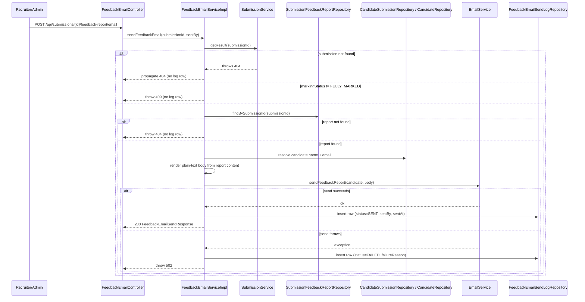
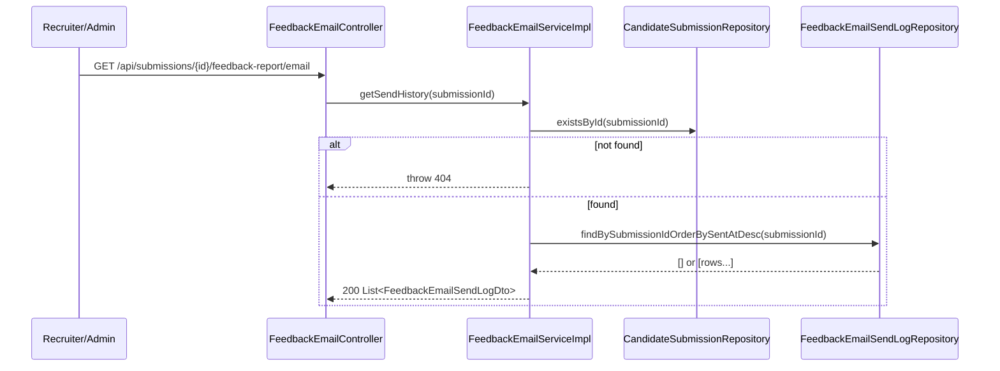

# Design Document

## Overview

This feature adds a new `feedback-email` capability that lets a recruiter or admin email a candidate's already-generated AI feedback report (produced by the existing `submission-feedback-report` feature) as a plain-text email body. The candidate has no login, so the entire report content — overall summary, per-topic strengths/weaknesses, and next steps — is rendered directly into the email body rather than delivered via a link.

The feature is intentionally narrow in scope:
- It does **not** generate feedback reports (that's `submission-feedback-report`'s job — this feature only reads an existing report).
- It does **not** introduce new candidate-facing surface area — it is entirely staff-triggered and backend-only.
- It follows the exact "send + append-only log" shape already established by the `reminder` feature's `ReminderSendLog`, so a recruiter can resend as many times as needed and always has a full audit trail.

Key behavioral guarantees driving the design:
- Sending is gated on the submission being `FULLY_MARKED` (via the existing `SubmissionService.getResult()`) **and** a `SubmissionFeedbackReport` already existing for that submission.
- A failed send (an exception thrown by `EmailService`) is fully isolated: it only ever produces a `FAILED` row in the new send-log table. No other table is touched, and there is no limit on retries.
- Every send attempt — successful or failed — is durably recorded, and prior rows are immutable (never updated/deleted) on resend.

## Architecture

The feature is implemented as a new package-by-feature module, `feedback` — wait, `feedback` already exists as the `submission-feedback-report` package. To keep with package-by-feature conventions while avoiding collision, this feature's code lives in a new sibling package: `feedbackemail`.

```
com.psybergate.recruitment.feedbackemail/
├── FeedbackEmailController.java          # REST endpoints
├── FeedbackEmailService.java             # Service interface
├── FeedbackEmailServiceImpl.java         # Service implementation
├── domain/
│   └── FeedbackEmailSendLog.java         # New entity (mirrors ReminderSendLog)
├── dto/
│   ├── FeedbackEmailSendResponse.java    # POST response
│   └── FeedbackEmailSendLogDto.java      # GET history item
└── repository/
    └── FeedbackEmailSendLogRepository.java
```

This mirrors the `reminder` package's shape exactly (`ReminderSendLog` in the feature root, `dto/` and `repository/` subpackages) since that is the pattern this feature is explicitly asked to follow.

The service composes three existing collaborators rather than duplicating their logic:
- **`SubmissionService`** (from `marking`) — supplies `markingStatus` via `getResult(submissionId)`, and implicitly validates the submission exists (throws 404 otherwise).
- **`SubmissionFeedbackReportRepository`** (from `feedback.repository`) — supplies the persisted report content to render into the email body.
- **`EmailService`** (from `email`) — sends the rendered plain-text email. A new method is added to this shared interface (`sendFeedbackReport`) following the existing pattern of one method per email type (`sendInvitation`, `sendReminder`, `sendCancellation`, `sendContactMessage`).

Additionally, `CandidateSubmissionRepository` and `CandidateRepository` (both shared, top-level `repository/`) are used to resolve the candidate's name/email from the submission, the same way `SubmissionServiceImpl.getResult()` does.

### Request flow (send / resend)



### History flow (GET)



## Components and Interfaces

### `FeedbackEmailController`

```java
@RestController
@PreAuthorize("hasAnyRole('RECRUITER','ADMIN')")
@RequiredArgsConstructor
public class FeedbackEmailController {

    private final FeedbackEmailService feedbackEmailService;

    @PostMapping("/api/submissions/{submissionId}/feedback-report/email")
    public ResponseEntity<FeedbackEmailSendResponse> send(
            @PathVariable UUID submissionId,
            Authentication auth) {
        UUID sentBy = UUID.fromString(auth.getName());
        return ResponseEntity.ok(feedbackEmailService.sendFeedbackEmail(submissionId, sentBy));
    }

    @GetMapping("/api/submissions/{submissionId}/feedback-report/email")
    public ResponseEntity<List<FeedbackEmailSendLogDto>> history(@PathVariable UUID submissionId) {
        return ResponseEntity.ok(feedbackEmailService.getSendHistory(submissionId));
    }
}
```

This mirrors `FeedbackReportController` and `ReminderController`: class-level `@PreAuthorize`, constructor injection, `Authentication` used only to extract the acting user's ID for POST. `/api/submissions/**` is already covered by the existing `RECRUITER`/`ADMIN` security rule in `SecurityConfig`, and the class-level `@PreAuthorize` gives defense-in-depth consistent with sibling controllers.

### `FeedbackEmailService` (interface)

```java
public interface FeedbackEmailService {
    FeedbackEmailSendResponse sendFeedbackEmail(UUID submissionId, UUID sentBy);
    List<FeedbackEmailSendLogDto> getSendHistory(UUID submissionId);
}
```

### `FeedbackEmailServiceImpl`

Responsibilities, in order, per Requirement 2/3/6:

1. Call `submissionService.getResult(submissionId)` — this throws `ResponseStatusException(404)` if the submission doesn't exist (Req 2.2), and gives us `markingStatus` (Req 2.1).
2. If `markingStatus != "FULLY_MARKED"`, throw `ResponseStatusException(409, ...)` (Req 2.3). No log row is written — the method returns before any log-insert code runs.
3. Look up `SubmissionFeedbackReport` via `submissionFeedbackReportRepository.findBySubmissionId(submissionId)`. If absent, throw `ResponseStatusException(404, ...)` (Req 2.4). No log row written.
4. Resolve the candidate: load `CandidateSubmission` (already implicitly validated to exist by step 1, but the service loads it directly to reach `candidateId`) then `Candidate` by ID for name + email (Req 2.5).
5. Parse the report's stored JSON `content` into `FeedbackReportContent` (reusing the existing `ObjectMapper` + record, same as `FeedbackReportServiceImpl.parseContent`) and render a plain-text body containing `overallSummary`, each topic's `topic`/`strengths`/`weaknesses`, and `nextSteps[]` (Req 2.6).
6. Call `emailService.sendFeedbackReport(candidate, body)` (Req 2.7).
   - **On success**: build a `FeedbackEmailSendLog` with `status=SENT`, `sentBy`, `sentAt=Instant.now()` (via `@CreationTimestamp`), save it, and return a `FeedbackEmailSendResponse` (Req 2.8, 2.11).
   - **On exception**: catch it, build a `FeedbackEmailSendLog` with `status=FAILED`, a non-blank `failureReason` derived from the exception message (falling back to a generic message if blank/null), save it, then rethrow as `ResponseStatusException(502, ...)` (Req 2.9). Because the catch block only performs one `save()` against the new log table and touches nothing else, Req 2.10/6.1/6.2 (isolation) hold structurally — there is no code path that could mutate `CandidateSubmission`, `AnswerScore`, or `SubmissionFeedbackReport` after the report was read.

Resends (Requirement 3) require no special-case code: every POST re-runs this exact sequence from scratch, so a second call after a `FAILED` row (or a `SENT` row) is evaluated identically, and each call inserts its own new row without ever touching a prior one (Req 3.1–3.3). No retry counter or rate limit is introduced (Req 6.3).

`getSendHistory`:
1. Verify the submission exists (`candidateSubmissionRepository.existsById(submissionId)`); throw 404 otherwise (Req 4.2).
2. Return `feedbackEmailSendLogRepository.findBySubmissionIdOrderBySentAtDesc(submissionId)` mapped to DTOs — an empty list is a valid, non-error result (Req 4.3).

### `EmailService` extension

A new method is added to the existing shared interface and its single implementation:

```java
public interface EmailService {
    void sendInvitation(Candidate candidate, Assessment assessment, String invitationLink, Instant expiresAt, String plainPassword);
    void sendReminder(Candidate candidate, Assessment assessment, Instant expiresAt, String invitationLink);
    void sendCancellation(Candidate candidate, Assessment assessment);
    void sendContactMessage(Candidate candidate, String subject, String message);
    void sendFeedbackReport(Candidate candidate, String plainTextBody); // NEW
}
```

`EmailServiceImpl.sendFeedbackReport` follows the same `SimpleMailMessage` pattern as the other methods (`setTo(candidate.getEmail())`, a fixed subject like `"Your Assessment Feedback"`, `setText(plainTextBody)`, `mailSender.send(message)`), delegating body construction to the caller since the body here is data-driven (report content) rather than a fixed template with a couple of interpolated fields. This keeps `EmailServiceImpl` a thin transport wrapper, consistent with its existing role, while `FeedbackEmailServiceImpl` owns the report-to-text rendering logic (it's the one with access to `FeedbackReportContent`).

### Plain-text body rendering

Rendering lives in `FeedbackEmailServiceImpl` as a private helper, e.g.:

```
Hi <firstName>,

Here is your feedback for <assessment context not required per requirements — omit unless needed>:

<overallSummary>

<topic 1>
Strengths: <strengths>
Weaknesses: <weaknesses>

<topic 2>
...

Next steps:
- <nextStep 1>
- <nextStep 2>
...

The Psybergate Recruitment Team
```

This mirrors the greeting/sign-off convention already used by every `EmailServiceImpl` body-builder method.

## Data Models

### New entity: `FeedbackEmailSendLog`

Mirrors `ReminderSendLog` field-for-field where the shape matches, substituting `submissionId` for `invitationId` and adding `failureReason`:

```java
@Entity
@Table(name = "feedback_email_send_log")
@Getter
@Setter
@NoArgsConstructor
public class FeedbackEmailSendLog {

    @Id
    @GeneratedValue(strategy = GenerationType.UUID)
    private UUID id;

    @Column(name = "submission_id", nullable = false)
    private UUID submissionId;

    @CreationTimestamp
    @Column(name = "sent_at", nullable = false, updatable = false)
    private Instant sentAt;

    @Column(name = "sent_by")
    private UUID sentBy;

    @Enumerated(EnumType.STRING)
    @Column(nullable = false, length = 10)
    private FeedbackEmailSendStatus status;

    @Column(name = "failure_reason", columnDefinition = "TEXT")
    private String failureReason;
}
```

`submissionId`/`sentBy` are stored as plain `UUID` columns (not `@ManyToOne`) rather than entity associations, matching `SubmissionFeedbackReport.submissionId` and `ReminderSendLog.sentBy` respectively — both existing patterns store the "who" as a raw FK UUID without a mapped relationship, since nothing here needs to navigate the association graph.

`FeedbackEmailSendStatus` enum (new, feature-owned):
```java
public enum FeedbackEmailSendStatus {
    SENT,
    FAILED
}
```

### Repository

```java
public interface FeedbackEmailSendLogRepository extends JpaRepository<FeedbackEmailSendLog, UUID> {
    List<FeedbackEmailSendLog> findBySubmissionIdOrderBySentAtDesc(UUID submissionId);
}
```

### DTOs

```java
public record FeedbackEmailSendResponse(
        UUID submissionId,
        FeedbackEmailSendStatus status,
        Instant sentAt
) {}

public record FeedbackEmailSendLogDto(
        Instant sentAt,
        FeedbackEmailSendStatus status,
        UUID sentBy,
        String failureReason
) {
    public static FeedbackEmailSendLogDto from(FeedbackEmailSendLog log) {
        return new FeedbackEmailSendLogDto(log.getSentAt(), log.getStatus(), log.getSentBy(), log.getFailureReason());
    }
}
```

### Flyway migration (`V25__create_feedback_email_send_log.sql`)

Following the numbering sequence (latest existing is `V24`) and the `V13__reminder_notifications.sql` / `V9__create_answer_scores.sql` style (named constraints, `gen_random_uuid()` default, explicit index for the FK lookup column):

```sql
-- Send-history log for candidate feedback-report emails (mirrors reminder_send_log)

CREATE TABLE feedback_email_send_log (
    id              UUID        NOT NULL DEFAULT gen_random_uuid(),
    submission_id   UUID        NOT NULL REFERENCES candidate_submissions (id) ON DELETE CASCADE,
    sent_at         TIMESTAMPTZ NOT NULL DEFAULT now(),
    sent_by         UUID        REFERENCES users (id),
    status          VARCHAR(10) NOT NULL,
    failure_reason  TEXT,
    CONSTRAINT feedback_email_send_log_pk           PRIMARY KEY (id),
    CONSTRAINT feedback_email_send_log_status_check CHECK (status IN ('SENT', 'FAILED')),
    CONSTRAINT feedback_email_send_log_failure_reason_check CHECK (
        (status = 'FAILED' AND failure_reason IS NOT NULL AND failure_reason <> '')
        OR
        (status = 'SENT' AND failure_reason IS NULL)
    )
);

CREATE INDEX idx_feedback_email_send_log_submission_id ON feedback_email_send_log (submission_id);
```

Notes on this schema, tying directly back to Requirement 1:
- No unique constraint on `submission_id` — multiple rows per submission are expected and required for resends (Req 1.2).
- The `CHECK` constraint enforces the `FAILED` ⇔ non-null/non-blank `failure_reason` and `SENT` ⇔ null `failure_reason` pairing at the database level (Req 1.4), so this invariant holds even if application code has a bug — it's not just enforced by the service layer.
- `ON DELETE CASCADE` on `submission_id` matches the existing convention for submission-scoped child tables (e.g. `submission_flags`, `submission_feedback_reports`).

## Correctness Properties

*A property is a characteristic or behavior that should hold true across all valid executions of a system-essentially, a formal statement about what the system should do. Properties serve as the bridge between human-readable specifications and machine-verifiable correctness guarantees.*

The prework above classified most acceptance criteria as PROPERTY-suitable (this feature is almost entirely pure decision logic + rendering + append-only logging over mocked/in-memory collaborators, which is ideal for PBT), with a small number of EXAMPLE/EDGE_CASE criteria (access control, the CHECK-constraint combinations, the empty-history GET case) better served by targeted unit/integration tests. The reflection step above consolidated 16 initially-classified criteria into 10 non-redundant properties, three of which (existence/marking-status/report-existence gates) are deliberately phrased to be history-independent so they cover both the fresh-send (Requirement 2) and resend (Requirement 3) cases with a single statement.

### Property 1: Unknown submission is always rejected with 404, regardless of history

*For any* submission ID that does not correspond to an existing `CandidateSubmission`, and *for any* prior send-log history for that ID (including none), POSTing to `/api/submissions/{id}/feedback-report/email` returns HTTP 404, does not invoke `EmailService`, and leaves the send-log row count for that ID unchanged.

**Validates: Requirements 2.2, 3.1**

### Property 2: Non-fully-marked submissions are always rejected with 409, regardless of history

*For any* existing submission whose computed `markingStatus` (via `SubmissionService.getResult()`) is not `FULLY_MARKED`, and *for any* prior send-log history for that submission (including none, and including prior `FAILED` rows from earlier attempts), POSTing to the send endpoint returns HTTP 409, does not invoke `EmailService`, and leaves the send-log row count for that submission unchanged.

**Validates: Requirements 2.3, 3.1, 3.2, 6.3**

### Property 3: Missing report is always rejected with 404, regardless of history

*For any* `FULLY_MARKED` submission for which no `SubmissionFeedbackReport` exists, and *for any* prior send-log history for that submission (including none), POSTing to the send endpoint returns HTTP 404, does not invoke `EmailService`, and leaves the send-log row count for that submission unchanged.

**Validates: Requirements 2.4, 3.1**

### Property 4: Rendered email body contains the full report content

*For any* `SubmissionFeedbackReport` content (any `overallSummary` string, any list of 0..N topics each with a topic/strengths/weaknesses string, and any list of 0..N `nextSteps` strings, including strings containing whitespace-only or special characters), the plain-text body rendered for that report contains the `overallSummary` text, and for every topic contains its topic name, strengths, and weaknesses, and for every next step contains that step's text.

**Validates: Requirements 2.6**

### Property 5: Email is always addressed to the submission's actual candidate

*For any* `FULLY_MARKED` submission with an existing report, when the send succeeds or fails, `EmailService.sendFeedbackReport` is invoked with the `Candidate` object corresponding to that submission's `candidateId` — never a different candidate's record — regardless of how many other candidates/submissions exist in the system.

**Validates: Requirements 2.5, 2.7**

### Property 6: Send outcome is faithfully recorded and reported

*For any* `FULLY_MARKED` submission with an existing report, and *for any* behavior of the `EmailService` call (returns normally, or throws an exception with any message including blank/null), exactly one new `feedback_email_send_log` row is inserted such that: if the call succeeded, the row has `status = SENT`, `sentBy` equal to the acting user's ID, and a non-null `sentAt`, and the endpoint returns HTTP 200 with a `FeedbackEmailSendResponse` whose `submissionId`/`status`/`sentAt` match that row; if the call threw, the row has `status = FAILED` and a non-blank `failureReason`, and the endpoint returns HTTP 502.

**Validates: Requirements 1.3, 2.1, 2.8, 2.9, 2.11**

### Property 7: Failed sends are fully isolated to the send-log table

*For any* submission and any send attempt where `EmailService` throws, the `CandidateSubmission` row, all `AnswerScore` rows, and the `SubmissionFeedbackReport` row associated with that submission are byte-for-byte identical immediately before and immediately after the attempt — the only persisted change from the attempt is the insertion of one new `feedback_email_send_log` row carrying `status = FAILED` and the `failureReason`.

**Validates: Requirements 2.10, 6.1, 6.2**

### Property 8: Resends are append-only — prior send-log rows are never mutated

*For any* sequence of N (N >= 0) prior send attempts against the same submission, each producing either a `SENT` or `FAILED` row, a subsequent send attempt against that same submission inserts exactly one new row and leaves every one of the N prior rows byte-for-byte unchanged (same ID, `sentAt`, `sentBy`, `status`, `failureReason`) — no prior row is ever updated, overwritten, or deleted, and no uniqueness constraint on `submissionId` ever rejects the new insert.

**Validates: Requirements 1.2, 3.3**

### Property 9: Send history is returned complete, correctly mapped, and ordered

*For any* existing submission and *for any* set of persisted `feedback_email_send_log` rows for it (including zero rows), GETting the send-history endpoint returns HTTP 200 with a list that has exactly one entry per persisted row, each entry's `sentAt`/`status`/`sentBy`/`failureReason` matching the corresponding row's fields, with the overall list ordered by `sentAt` descending.

**Validates: Requirements 4.1, 4.3**

### Property 10: Unknown submission is always rejected with 404 on history retrieval

*For any* submission ID that does not correspond to an existing `CandidateSubmission`, GETting `/api/submissions/{id}/feedback-report/email` returns HTTP 404.

**Validates: Requirements 4.2**

## Error Handling

All new failure modes follow the existing convention of throwing `ResponseStatusException` (or a dedicated `@ResponseStatus`-annotated exception, matching `AiResponseException`/`AiCommunicationException`/`AiMarkingResponseException` for the 502 case) from the service layer, with `GlobalExceptionHandler`'s catch-all `Exception` handler translating any `@ResponseStatus`-annotated type it doesn't explicitly know about into a `ProblemDetail`. No new `@ExceptionHandler` methods are needed.

| Scenario | Exception | HTTP Status | Notes |
|---|---|---|---|
| `submissionId` doesn't exist (POST) | `ResponseStatusException` (propagated from `SubmissionService.getResult()`) | 404 | No log row written. |
| Submission exists, `markingStatus != FULLY_MARKED` | `ResponseStatusException` | 409 | Thrown by `FeedbackEmailServiceImpl` after inspecting `getResult()`'s output. No log row written. |
| Submission `FULLY_MARKED`, no `SubmissionFeedbackReport` | `ResponseStatusException` | 404 | Thrown by `FeedbackEmailServiceImpl` after `findBySubmissionId()` returns empty. No log row written. |
| `EmailService.sendFeedbackReport(...)` throws (any cause — SMTP failure, timeout, etc.) | Caught in `FeedbackEmailServiceImpl`; a `FAILED` log row is saved, then a new `ResponseStatusException` (502) is thrown to the caller | 502 | The log row is written *before* the exception propagates, in the same transaction boundary as the rest of the method — see Transaction Boundary note below. |
| `submissionId` doesn't exist (GET) | `ResponseStatusException` | 404 | Thrown from `getSendHistory()` after `existsById()` check. |
| Caller lacks `RECRUITER`/`ADMIN` role | `AccessDeniedException` (raised by `@PreAuthorize`) | 403 | Already handled globally by `GlobalExceptionHandler.handleAccessDenied`. |
| Missing/invalid JWT | Handled upstream by `JwtAuthenticationFilter`/Spring Security before reaching the controller | 401 | No feature-specific code needed. |

**Transaction boundary note**: Unlike most service methods in this codebase that are `@Transactional` end-to-end, `sendFeedbackEmail` must ensure the `FAILED` log row is durably committed even though the method ultimately throws. The implementation isolates the log-write in its own transaction (e.g. by having `FeedbackEmailServiceImpl` delegate the `save()` call to a `@Transactional(propagation = Propagation.REQUIRES_NEW)` step, or simply by not wrapping the whole method in a single `@Transactional` and instead letting each repository call commit independently) so that the exception thrown after logging the failure does not roll back the very row meant to record it. This mirrors the general principle already in play for `ai` failures (AI failures don't block manual marking) — a failure in one concern must not silently disappear.

## Testing Strategy

**Dual approach**: unit tests (via Mockito, following `*ServiceTest` conventions) cover the gating logic, rendering, and error-status mapping in isolation; property-based tests (via `jqwik`, already a test-scope dependency per `tech.md`) cover the ten universal properties above with randomized inputs; a small number of integration tests (via `*ControllerIntegrationTest` against the real TestContainers Postgres) cover the schema-level `CHECK` constraint, access control, and the end-to-end wiring that unit tests can't exercise (real Flyway migration, real security filter chain).

### Property-based tests (jqwik, ≥100 iterations each)

Each property from the design maps to exactly one `@Property`-annotated jqwik test in a new `FeedbackEmailServiceTest` (unit-level, `@Mock` collaborators) or `FeedbackEmailServiceIntegrationTest` (for properties 8/9 that need real row-persistence semantics across multiple calls) test class:

| Design Property | Test location | Generators |
|---|---|---|
| 1. Unknown submission → 404 | `FeedbackEmailServiceTest` | random UUID not present in mocked repo; random-length list of prior log rows |
| 2. Not-fully-marked → 409 | `FeedbackEmailServiceTest` | random `ResultSummaryResponse` with `markingStatus` != `FULLY_MARKED`; random prior-history list |
| 3. Missing report → 404 | `FeedbackEmailServiceTest` | `FULLY_MARKED` result + report repo mocked to return empty; random prior-history list |
| 4. Rendered body completeness | `FeedbackEmailServiceTest` (pure function test, no mocks needed) | random `FeedbackReportContent` (jqwik `Arbitraries.strings()` for text fields, `Arbitraries.of(...).list()` for topics/nextSteps of size 0–10, including strings with newlines/unicode) |
| 5. Correct addressing | `FeedbackEmailServiceTest` | random pool of `Candidate` records + random submission pointing at one of them |
| 6. Outcome faithfully recorded | `FeedbackEmailServiceTest` | random boolean (throw or not) + random exception message (including blank/null) fed to the mocked `EmailService` |
| 7. Failed-send isolation | `FeedbackEmailServiceTest` | random snapshot of `CandidateSubmission`/`AnswerScore`/`SubmissionFeedbackReport` mock state, captured before/after a forced-failure send |
| 8. Append-only resends | `FeedbackEmailServiceIntegrationTest` | random sequence length N (0–20) and random per-attempt outcome (success/fail), run against a real repository (TestContainers) |
| 9. History retrieval correctness | `FeedbackEmailServiceIntegrationTest` | random set of persisted log rows (0–20) with random timestamps/statuses/sentBy/failureReason |
| 10. GET unknown → 404 | `FeedbackEmailServiceTest` | random UUID not present in mocked repo |

Each test tags its assertion block with a comment in the required format, e.g.:
```java
// Feature: candidate-feedback-email, Property 6: Send outcome is faithfully recorded and reported
@Property
void sendOutcomeIsFaithfullyRecorded(@ForAll boolean emailThrows, @ForAll("exceptionMessages") String message) {
    ...
}
```

### Unit tests (example-based)

- `FeedbackEmailControllerTest` / service-level: a concrete "happy path" send (fully marked, report exists, email succeeds) producing a `SENT` row and 200 response — a readable end-to-end example beyond the properties.
- A concrete resend example: send once (fails), send again (succeeds), assert both rows exist with correct statuses in the right order — a small illustrative case alongside Property 8's generalized version.
- `EmailServiceImpl.sendFeedbackReport` unit test verifying the `SimpleMailMessage` is addressed/subjected/bodied correctly for one representative report.

### Integration tests

- `FeedbackEmailControllerIntegrationTest` (extends `AbstractIntegrationTest`, real TestContainers Postgres, real security filter chain):
  - Access control matrix (Requirement 5): POST and GET as `ADMIN` (200/201), `RECRUITER` (200/201), `CANDIDATE` (403, empty body), no auth (401, empty body) — 8 example cases total, run once each (EXAMPLE classification from prework, not PBT-appropriate given the small enumerable role set).
  - Schema `CHECK` constraint (Requirement 1.4): four example inserts directly via the repository — `(SENT, null)` succeeds, `(SENT, "reason")` fails, `(FAILED, "reason")` succeeds, `(FAILED, null)` fails — asserting a `DataIntegrityViolationException` on the two invalid combinations (already mapped to 409 by `GlobalExceptionHandler` if ever reached through application code, though the service layer should never construct an invalid combination in practice).
  - One smoke test confirming the `V25__create_feedback_email_send_log.sql` migration applies cleanly and the table/columns/indexes exist as expected (Requirement 1.1).

This keeps the property tests focused on the feature's actual decision/rendering/logging logic (where input variation matters and bugs hide), while access control, the discrete constraint-combination space, and one-time schema setup — none of which benefit from 100 randomized iterations — stay as small, explicit example tests, consistent with the project's existing `*ServiceTest`/`*ControllerIntegrationTest` split.
