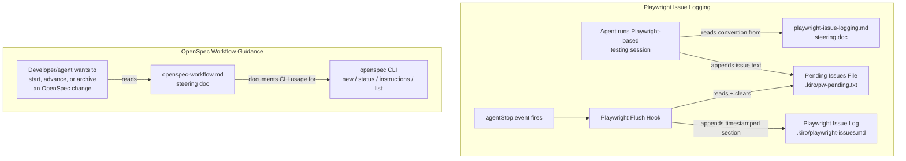

# Design Document

## Overview

This feature ports two capabilities from `.claude/` to Kiro-native primitives:

1. **Playwright issue logging** — a pending-file + flush-on-stop pattern, reimplemented as a Kiro steering document (the convention) plus a Kiro `agentStop` hook (the flush mechanism).
2. **OpenSpec workflow guidance** — the six `opsx` slash-commands/skills, reimplemented as a single consolidated Kiro steering document that explains how to drive the same `openspec` CLI workflow conversationally, since Kiro has no slash-command/skill system.

Two Claude-Code capabilities are explicitly excluded (see Requirement 4 / "Out of Scope" below), because Kiro has no primitive capable of supporting them:

- **Prompt/usage/cost logging** (`log-prompt.sh` + `log-usage.sh`). Claude's `Stop` hook payload includes a `transcript_path` to a session JSONL file, which `log-usage.sh` parses to sum `usage.input_tokens` / `output_tokens` / `cache_creation_input_tokens` / `cache_read_input_tokens` per turn and multiply by Sonnet 4.6 per-token pricing. Kiro's hook tool (`create_hook`) exposes lifecycle events (`agentStop`, `preToolUse`, `postToolUse`, etc.) but does not pass a transcript path or token-usage payload to the triggered action — there is nothing for a Kiro hook to read to reconstruct token counts or cost. This is a platform capability gap, not a design choice, so no Kiro equivalent is built.
- **Dev-server launch config** (`.claude/launch.json`, an `npm start --prefix recruitment-fe -- --port 4300` launch entry). Kiro has no analogous "launch configuration" primitive that another tool (like a debugger/run panel) reads. Reproducing this would mean inventing a new file format Kiro doesn't consume anywhere, which isn't a faithful capability port.

Both exclusions are recorded here so the reasoning is discoverable without re-deriving it later.

## Architecture

Both capabilities are implemented entirely as static configuration/documentation artifacts — a markdown steering file and a hook definition (also markdown/JSON managed by Kiro's hook tooling). There is no application code, no runtime service, and no build step. The "system" here is Kiro itself interpreting these artifacts:



Neither subsystem depends on the other. They are grouped in one feature only because they were both extracted from `.claude/` in the same audit.

## Components and Interfaces

### 1. Playwright_Issue_Steering_Doc (`.kiro/steering/playwright-issue-logging.md`)

A steering document (not `inclusion: auto` — it's manually relevant only during Playwright/browser-testing sessions, so it uses the default manual-inclusion behavior of a plain steering file) that documents:

- **Pending_Issues_File** path: `.kiro/pw-pending.txt`
- **Playwright_Issue_Log** path: `.kiro/playwright-issues.md`
- **Entry format** for appending to the pending file: one issue per append, free-text, matching the structure already used in the legacy `.claude/playwright-issues.md` (Issue title / Tool / Input / Error / Fix, or a looser narrative note — the doc gives the same template Claude's log used, since that format has already proven useful in this repo).
- **Instruction to the agent**: when a Playwright-based testing/debugging session surfaces a reproducible issue, tool quirk, or workaround, append an entry to the Pending_Issues_File immediately (do not wait until end of session) using a file-append action.
- **Flush heading format**: describes that the Playwright_Flush_Hook will wrap flushed content under `## <timestamp>` when moving it into the persistent log, so the agent does not need to add its own top-level heading when appending to the pending file — only issue-level sub-headings.

### 2. Playwright_Flush_Hook

Created via the hook tooling (`create_hook`) as an `agentStop` event hook with `askAgent` action (since the flush requires reading a file, conditionally appending with a formatted timestamp, and clearing it — logic best expressed as an instruction to the agent rather than a fixed shell one-liner, and consistent with how the rest of this feature avoids introducing new shell scripts). The hook's instruction:

1. Check whether `.kiro/pw-pending.txt` exists and is non-empty.
2. If empty or missing, do nothing.
3. Otherwise:
   - If `.kiro/playwright-issues.md` does not exist, create it with a `# Playwright Issue Log` top-level heading.
   - Append a new section `## <current timestamp>` followed by the full contents of `.kiro/pw-pending.txt`, then a horizontal rule (`---`) separator — mirroring the structure of the legacy `.claude/playwright-issues.md`.
   - Clear (truncate) `.kiro/pw-pending.txt`.

Hook definition summary (created via `create_hook`, not hand-written JSON):
- `eventType`: `agentStop`
- `hookAction`: `askAgent`
- `outputPrompt`: instructs the agent to perform the check-flush-clear sequence above
- `id`: `playwright-issue-flush`
- `name`: "Flush Playwright Issue Log"

### 3. OpenSpec_Workflow_Steering_Doc (`.kiro/steering/openspec-workflow.md`)

A single steering document with one section per operation, each documenting the underlying `openspec` CLI usage (mirroring what the `opsx` commands/skills did, minus Claude-specific tooling like `AskUserQuestion`/`TodoWrite`, replaced with Kiro-native equivalents where relevant):

| Section | Underlying OpenSpec_CLI usage | Notes |
|---|---|---|
| Starting a new change | `openspec new change "<name>" [--schema <name>]`, `openspec status --change "<name>"`, `openspec instructions <first-artifact-id> --change "<name>"` | Stops after showing the first artifact template; does not auto-create artifacts. |
| Proposing a change (all artifacts at once) | `openspec new change "<name>"`, `openspec status --change "<name>" --json`, loop of `openspec instructions <artifact-id> --change "<name>" --json` per artifact until `applyRequires` are all `done` | Documents the artifact dependency loop and that `context`/`rules` fields are constraints, not file content. |
| Fast-forwarding | Same CLI sequence as "proposing", framed as skipping intermediate review stops | Distinguishes from "proposing" only in stance (batch vs. reviewed), not CLI calls — the doc notes they are operationally identical and lets the user pick the framing that matches their workflow. |
| Explore/thinking-mode stance | `openspec list --json` to check for existing changes/context; no artifact-mutating commands unless the user asks | Documents the "don't implement, don't auto-capture" stance and the table of insight-type → artifact-to-update. |
| Applying (implementing) tasks | `openspec status --change "<name>" --json`, `openspec instructions apply --change "<name>" --json`, reading `contextFiles`, editing task checkboxes in the tasks artifact | Documents the blocked/all_done/in-progress states and the pause conditions (unclear task, design issue, error, user interrupt). |
| Archiving a change | `openspec list --json` (if name not given), `openspec status --change "<name>" --json` for artifact completion, tasks-file checkbox count for task completion, delta spec diffing under `openspec/changes/<name>/specs/`, then moving the directory to `openspec/changes/archive/YYYY-MM-DD-<name>/` | Documents the pre-archive completeness warnings and that warnings don't block archiving. |

This document is consistent with the existing `structure.md` / `product.md` steering guidance that already tells Kiro to check `openspec/specs/` before starting new work and to choose between OpenSpec and a Kiro spec — the new doc does not restate or contradict that decision guidance, it only documents *how* to execute OpenSpec CLI operations once OpenSpec has been chosen.

## Data Models

No application data models are introduced. The only "data" are two flat files:

- **Pending_Issues_File** (`.kiro/pw-pending.txt`): plain text, append-only during a session, one or more free-text issue entries separated by blank lines. Cleared (truncated to empty) after each successful flush.
- **Playwright_Issue_Log** (`.kiro/playwright-issues.md`): Markdown, append-only across the file's lifetime except for the one-time creation of its top-level heading. Structure per flush:

  ```markdown
  ## 2026-06-10 14:32:00

  <verbatim content of the pending file at flush time>

  ---
  ```

## Error Handling

- **Pending file missing or empty at flush time**: no-op; the Playwright_Issue_Log is left untouched (Requirement 2.4).
- **Playwright_Issue_Log missing at flush time**: created with a top-level `# Playwright Issue Log` heading before the first section is appended (Requirement 2.5).
- **Clear step fails after a successful append** (e.g. file locked): accepted risk per clarification during requirements review — the same entries may be flushed again on a subsequent `agentStop`, producing a duplicate section in the log. This is preferred over losing data, and duplicate sections are low-cost (a human skims a markdown log; duplication is easy to spot and merge manually).
- **Malformed or missing steering docs**: not applicable — these are the artifacts being created, not external inputs being parsed.

## Testing Strategy

This feature has no algorithmic logic, parser/serializer, or data transformation — it is entirely steering documentation and a hook whose "behavior" is an LLM-interpreted instruction. Per the design guidelines, property-based testing does not apply here (no pure function, no meaningfully input-varying behavior to generate over). Verification is done via manual/example-based checks instead:

- **Example-based verification of the Playwright_Flush_Hook** (manual, one-time per implementation, not automated unit tests since there is no test harness for hook instructions):
  1. Create `.kiro/pw-pending.txt` with sample issue text, trigger `agentStop`, confirm the content is appended under a timestamped heading in `.kiro/playwright-issues.md` and the pending file is cleared.
  2. Trigger `agentStop` with no pending file present, confirm `.kiro/playwright-issues.md` is unchanged (or absent if never created).
  3. Delete `.kiro/playwright-issues.md`, trigger a flush with pending content present, confirm the log file is created with the correct top-level heading before the section is appended.
- **Review-based verification of both steering documents**: confirm each acceptance criterion in Requirements 1 and 3 is addressed by re-reading the finished steering doc section-by-section against the requirement list (documentation correctness is verified by review, not automated test).
- **No integration or smoke tests are applicable** — there is no deployed service, external API, or infrastructure being configured.
