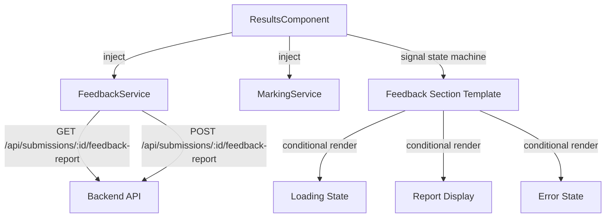
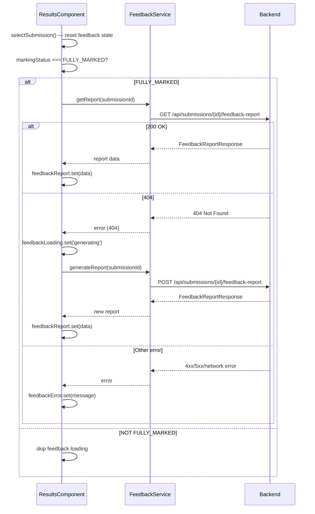

# Design Document: Submission Feedback Report Frontend

## Overview

This design adds an AI-generated feedback report section to the existing Results & Evaluation page. The implementation introduces a `FeedbackService` under `core/feedback/`, model interfaces for the API contract, and a signal-based state machine within `ResultsComponent` to manage the GET→404→POST auto-generation flow, loading/error states, and a regenerate capability.

The feature follows existing project conventions: standalone injectable services with `inject()`, signals for reactive state, inline templates/styles, and CSS variables for theming.

## Architecture



**Data Flow — Auto-Generation Sequence:**



## Components and Interfaces

### New Files

| File | Purpose |
|------|---------|
| `core/feedback/feedback.model.ts` | TypeScript interfaces for API response |
| `core/feedback/feedback.service.ts` | Injectable HTTP service for feedback endpoints |
| `core/feedback/feedback.service.spec.ts` | Vitest unit tests for service |

### FeedbackService Interface

```typescript
// core/feedback/feedback.service.ts
@Injectable({ providedIn: 'root' })
export class FeedbackService {
  private readonly http = inject(HttpClient);

  getReport(submissionId: string): Observable<FeedbackReportResponse> {
    if (!submissionId) throw new Error('submissionId must not be empty');
    return this.http.get<FeedbackReportResponse>(
      `/api/submissions/${submissionId}/feedback-report`
    );
  }

  generateReport(submissionId: string): Observable<FeedbackReportResponse> {
    if (!submissionId) throw new Error('submissionId must not be empty');
    return this.http.post<FeedbackReportResponse>(
      `/api/submissions/${submissionId}/feedback-report`,
      {}
    );
  }
}
```

### Signal State in ResultsComponent

New signals added to the component class:

```typescript
// Feedback state
private readonly feedbackSvc = inject(FeedbackService);

readonly feedbackReport = signal<FeedbackReportResponse | null>(null);
readonly feedbackLoading = signal<'fetching' | 'generating' | null>(null);
readonly feedbackError = signal<string | null>(null);
readonly regenerating = signal(false);
readonly regenerateError = signal<string | null>(null);
```

### State Reset on Submission Change

In `selectSubmission()`, append:

```typescript
this.feedbackReport.set(null);
this.feedbackLoading.set(null);
this.feedbackError.set(null);
this.regenerating.set(false);
this.regenerateError.set(null);
```

### Auto-Generation Flow (in selectSubmission or effect)

After `getResult()` succeeds and `markingStatus === 'FULLY_MARKED'`:

```typescript
private loadFeedbackReport(submissionId: string): void {
  this.feedbackLoading.set('fetching');
  this.feedbackError.set(null);

  this.feedbackSvc.getReport(submissionId).subscribe({
    next: report => {
      this.feedbackReport.set(report);
      this.feedbackLoading.set(null);
    },
    error: (err: HttpErrorResponse) => {
      if (err.status === 404) {
        this.feedbackLoading.set('generating');
        this.feedbackSvc.generateReport(submissionId).subscribe({
          next: report => {
            // Guard: only apply if still viewing same submission
            if (this.selectedSummary()?.submissionId === submissionId) {
              this.feedbackReport.set(report);
            }
            this.feedbackLoading.set(null);
          },
          error: () => {
            if (this.selectedSummary()?.submissionId === submissionId) {
              this.feedbackError.set('Could not generate feedback report. Please try again.');
            }
            this.feedbackLoading.set(null);
          },
        });
      } else {
        this.feedbackError.set('Could not load feedback report. Please try again.');
        this.feedbackLoading.set(null);
      }
    },
  });
}
```

### Stale Request Cancellation

Use a `Subscription` field that gets unsubscribed on each new submission selection:

```typescript
private feedbackSub?: Subscription;

// In selectSubmission():
this.feedbackSub?.unsubscribe();

// In loadFeedbackReport():
this.feedbackSub = this.feedbackSvc.getReport(submissionId).subscribe({ ... });
```

This ensures switching submissions while a request is in-flight discards the stale response.

### Regenerate with 30s Timeout

```typescript
regenerateReport(): void {
  const submissionId = this.selectedSummary()?.submissionId;
  if (!submissionId) return;

  this.regenerating.set(true);
  this.regenerateError.set(null);

  this.feedbackSvc.generateReport(submissionId)
    .pipe(timeout(30_000))
    .subscribe({
      next: report => {
        this.feedbackReport.set(report);
        this.regenerating.set(false);
      },
      error: (err) => {
        this.regenerating.set(false);
        if (err.name === 'TimeoutError') {
          this.regenerateError.set('Regeneration timed out. Please try again.');
        } else {
          this.regenerateError.set('Regeneration failed. Please try again.');
        }
      },
    });
}
```

### Template Integration Point

The feedback section is inserted **between the history-grid and answers-title**, guarded by `markingStatus === 'FULLY_MARKED'`:

```html
<!-- (existing) Histories side by side -->
<div class="history-grid">...</div>

<!-- NEW: Feedback Report Section -->
@if (result()!.markingStatus === 'FULLY_MARKED') {
  <section class="feedback-section" [attr.aria-busy]="feedbackLoading() !== null">
    @if (feedbackLoading()) {
      <div class="feedback-loading">
        <span class="loading-dot"></span>
        {{ feedbackLoading() === 'generating' ? 'Generating feedback report…' : 'Loading feedback report…' }}
      </div>
    } @else if (feedbackError()) {
      <div class="feedback-error">
        <span>{{ feedbackError() }}</span>
        <button class="save-btn" (click)="retryFeedback()">Retry</button>
      </div>
    } @else if (feedbackReport()) {
      <!-- Report content -->
      <div class="feedback-header">
        <span class="feedback-title">Feedback Report</span>
        @if (feedbackReport()!.aiGenerated) {
          <span class="ai-badge">AI Generated</span>
        }
        <button class="save-btn secondary regenerate-btn"
                (click)="regenerateReport()"
                [disabled]="regenerating()">
          {{ regenerating() ? 'Regenerating…' : 'Regenerate' }}
        </button>
      </div>
      @if (regenerateError()) {
        <div class="feedback-inline-error">
          {{ regenerateError() }}
          <button class="dismiss-btn" (click)="regenerateError.set(null)">✕</button>
        </div>
      }
      <p class="feedback-summary">{{ feedbackReport()!.content.overallSummary }}</p>
      @if (feedbackReport()!.content.topics.length > 0) {
        <div class="feedback-topics">
          @for (topic of feedbackReport()!.content.topics; track topic.name) {
            <div class="topic-card">
              <h4 class="topic-name">{{ topic.name }}</h4>
              <div class="topic-field"><span class="topic-label">Strength:</span> {{ topic.strength }}</div>
              <div class="topic-field"><span class="topic-label">Weakness:</span> {{ topic.weakness }}</div>
              <div class="topic-field"><span class="topic-label">Recommendation:</span> {{ topic.recommendation }}</div>
            </div>
          }
        </div>
      }
      @if (feedbackReport()!.content.nextSteps.length > 0) {
        <div class="feedback-next-steps">
          <h4 class="next-steps-heading">Next Steps</h4>
          <ol class="next-steps-list">
            @for (step of feedbackReport()!.content.nextSteps; track step) {
              <li>{{ step }}</li>
            }
          </ol>
        </div>
      }
      <div class="feedback-meta">Generated: {{ formatDateTime(feedbackReport()!.generatedAt) }}</div>
    }
  </section>
}

<!-- (existing) Per-question answers -->
<div class="answers-title">...</div>
```

## Data Models

```typescript
// core/feedback/feedback.model.ts

export interface FeedbackTopic {
  name: string;
  strength: string;
  weakness: string;
  recommendation: string;
}

export interface FeedbackReportContent {
  overallSummary: string;
  topics: FeedbackTopic[];
  nextSteps: string[];
}

export interface FeedbackReportResponse {
  submissionId: string;
  content: FeedbackReportContent;
  aiGenerated: boolean;
  promptVersion: string;
  generatedAt: string;
}
```

## Correctness Properties

*A property is a characteristic or behavior that should hold true across all valid executions of a system — essentially, a formal statement about what the system should do. Properties serve as the bridge between human-readable specifications and machine-verifiable correctness guarantees.*

### Property 1: Service URL Construction

*For any* non-empty submissionId string, `getReport(submissionId)` SHALL issue a GET request to exactly `/api/submissions/${submissionId}/feedback-report` and `generateReport(submissionId)` SHALL issue a POST to the same URL with an empty body.

**Validates: Requirements 1.2, 1.3**

### Property 2: Empty SubmissionId Validation

*For any* empty string (including whitespace-only strings after trimming), calling `getReport('')` or `generateReport('')` SHALL throw a synchronous error without making any HTTP request.

**Validates: Requirements 1.5**

### Property 3: Feedback Section Visibility Matches Marking Status

*For any* `ResultSummary`, the Feedback Report Section is rendered if and only if `markingStatus === 'FULLY_MARKED'`. For all other marking statuses, no feedback section container, loading indicator, or HTTP calls to the feedback endpoints SHALL be present.

**Validates: Requirements 2.1, 2.2, 3.6**

### Property 4: Topic Card Completeness

*For any* `FeedbackTopic` in the `topics` array, the rendered topic card SHALL contain the topic `name`, `strength`, `weakness`, and `recommendation` values — none may be omitted from the DOM.

**Validates: Requirements 4.2**

### Property 5: Error Messages Never Expose Technical Details

*For any* `HttpErrorResponse` received from `getReport()` or `generateReport()`, the user-facing error message SHALL NOT contain numeric HTTP status codes, stack traces, or raw error response bodies.

**Validates: Requirements 6.4**

## Error Handling

| Scenario | Behaviour |
|----------|-----------|
| `getReport()` → 404 | Auto-trigger `generateReport()` — expected for first-time access |
| `getReport()` → non-404 error | Display "Could not load feedback report" + Retry button |
| `generateReport()` → error (auto-gen) | Display "Could not generate feedback report" + Retry button |
| `generateReport()` → error (regenerate) | Keep existing report visible, show inline notification |
| `generateReport()` → 30s timeout | Abort request, re-enable Regenerate button, show timeout notification |
| Network error (status 0) | Same as HTTP error — generic user message |
| Submission change during request | Unsubscribe pending Observable, discard response |

**Retry flow:** Clicking "Retry" clears error, shows loading indicator, restarts full `getReport()` → (possibly 404 → `generateReport()`) flow from scratch.

**Regenerate error persistence:** Inline notification stays visible until dismissed or a new regeneration attempt starts.

## Testing Strategy

### Unit Tests (Vitest)

- **FeedbackService** — verify HTTP method, URL, body, and error throw for empty ID
- **ResultsComponent feedback signals** — verify state transitions (loading → loaded, loading → error, regenerating → done/error/timeout)
- **Template rendering** — verify conditional visibility, text content, aria attributes

### Property-Based Tests (fast-check + Vitest)

- Minimum 100 iterations per property
- Library: `fast-check` (already well-suited for TypeScript/Vitest)
- Configuration: `fc.assert(fc.property(...), { numRuns: 100 })`

| Property | Generator Strategy |
|----------|-------------------|
| 1: URL construction | `fc.string({ minLength: 1 })` for submissionId |
| 2: Empty validation | `fc.stringOf(fc.constant(' '))` + empty string |
| 3: Visibility | `fc.oneof(fc.constant('FULLY_MARKED'), fc.constant('PENDING_REVIEW'))` |
| 4: Topic completeness | `fc.record({ name: fc.string(), strength: fc.string(), weakness: fc.string(), recommendation: fc.string() })` |
| 5: Error sanitization | `fc.record({ status: fc.integer({ min: 400, max: 599 }), message: fc.string() })` |

### Integration Tests

- Full GET→404→POST flow with HttpClientTestingModule (Angular's `provideHttpClientTesting`)
- Stale request cancellation (select new submission mid-flight)
- 30s regeneration timeout using fake timers

### CSS/Accessibility Checks

- `aria-busy` attribute toggles correctly with loading state
- Loading indicators are CSS-only (no JS animation libraries)
- Color contrast verified against CSS variable values

### Styling Approach

All feedback section styles are added inline in `ResultsComponent`'s `styles` array, consistent with the existing component pattern. Key CSS:

```css
.feedback-section {
  margin: 0 0 14px;
  padding: 16px 18px;
  background: var(--bg-card);
  border: 1px solid var(--border);
  border-radius: var(--radius-lg);
  backdrop-filter: var(--glass-blur);
  -webkit-backdrop-filter: var(--glass-blur);
}

.feedback-loading {
  display: flex; align-items: center; gap: 10px;
  font-size: 13px; color: var(--text-2);
}

.loading-dot {
  width: 8px; height: 8px; border-radius: 50%;
  background: var(--accent);
  animation: pulse 1.2s ease-in-out infinite;
}

@keyframes pulse {
  0%, 100% { opacity: 0.3; transform: scale(0.8); }
  50% { opacity: 1; transform: scale(1); }
}

.ai-badge {
  font-size: 10.5px; padding: 2px 8px; border-radius: 999px;
  background: var(--accent-subtle); color: var(--accent);
  font-weight: 600;
}

.topic-card {
  padding: 12px 14px;
  background: var(--bg-elevated);
  border: 1px solid var(--border);
  border-radius: var(--radius-sm);
  margin-bottom: 8px;
}

.topic-name { font-size: 13px; font-weight: 600; color: var(--text-1); margin: 0 0 8px; }
.topic-label { font-weight: 600; color: var(--text-2); }
.topic-field { font-size: 12.5px; color: var(--text-2); margin-bottom: 4px; line-height: 1.5; }
```
